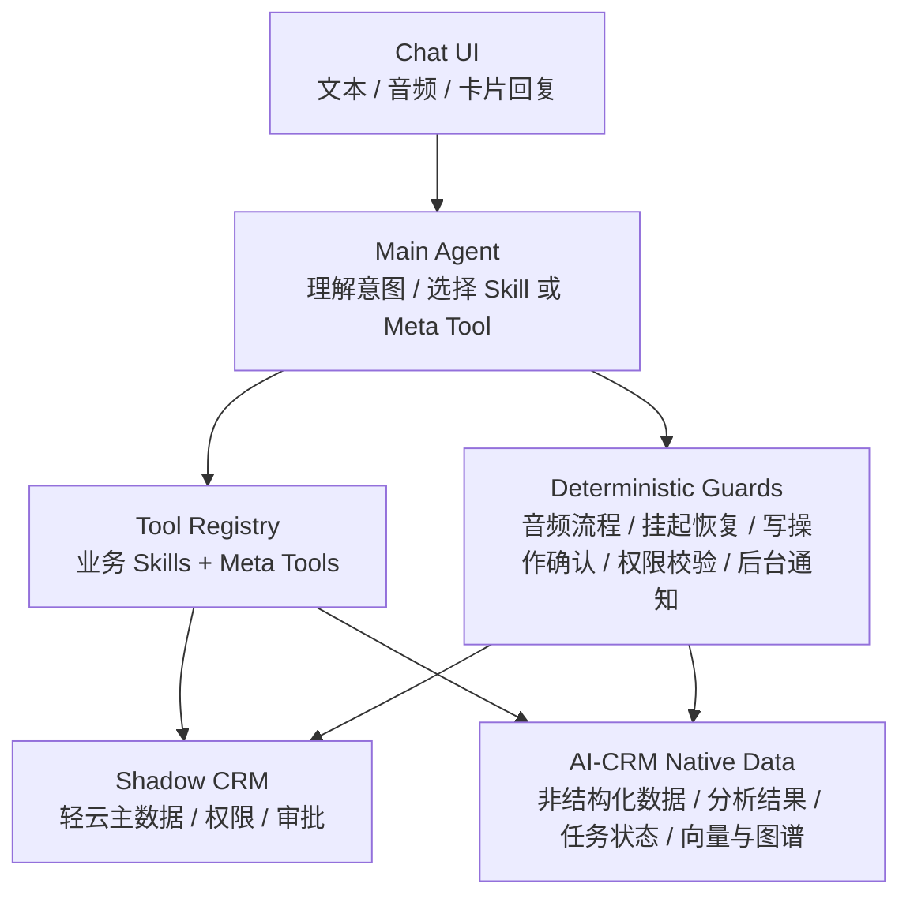

# 架构收敛与落地建议

> 本文是 AI-CRM 对话方案的收敛决策稿。它不再继续发散讨论，也不是纯实施清单，而是对 [04-实现方案详细设计.md](./04-实现方案详细设计.md)、[06-AI原生理念的务实落地-影子系统策略.md](./06-AI原生理念的务实落地-影子系统策略.md)、[07-架构模式探讨-分类分发vs主Agent+Skill.md](./07-架构模式探讨-分类分发vs主Agent+Skill.md) 的正式收口。

## 1. 为什么需要 08

到 07 为止，前序文档已经完成了从问题定义、用户场景、方案对比到目标架构的完整探索，但也形成了两个并存口径：

- [04-实现方案详细设计.md](./04-实现方案详细设计.md) 以 `Turn Router + 7 intentType + Handler 分发` 为主架构展开
- [07-架构模式探讨-分类分发vs主Agent+Skill.md](./07-架构模式探讨-分类分发vs主Agent+Skill.md) 则进一步收敛到 `主 Agent + Skills + Meta Tools`

这两种设计不能长期并列存在。继续并行保留，会带来三个问题：

1. 研发无法判断应该围绕哪套骨架建设模块
2. 产品无法定义最终用户体验是“先分类再执行”还是“主 Agent 直接完成”
3. 后续新增 Skill、澄清卡片、复合任务、审计日志时会重复建设

因此，08 的目标不是补充细节，而是正式做出以下收敛：

- 保留 [06-AI原生理念的务实落地-影子系统策略.md](./06-AI原生理念的务实落地-影子系统策略.md) 的影子系统路线
- 接受 [07-架构模式探讨-分类分发vs主Agent+Skill.md](./07-架构模式探讨-分类分发vs主Agent+Skill.md) 的目标架构方向
- 吸收 [04-实现方案详细设计.md](./04-实现方案详细设计.md) 中已经想清楚的澄清、任务持续、后台通知等企业级能力
- 明确哪些设计现在就做，哪些设计延后

## 2. 最终结论

本文给出的最终结论如下：

1. AI-CRM 的长期主架构不再采用 `Turn Router + 7 intentType` 作为核心骨架，而采用 `主 Agent + 业务 Skills + Meta Tools + 确定性守卫` 的混合模式。
2. `主 Agent` 负责理解用户请求并选择业务 Skill 或 Meta Tool；不再单独维护一个长期存在的“分类层”作为系统中心。
3. `影子系统` 继续保留。轻云负责结构化主数据、权限与审批，AI-CRM 负责对话理解、非结构化处理、分析、编排与任务状态。
4. 企业级确定性流程不能完全交给 Agent 自由发挥，必须保留少量 `Deterministic Guards` 作为兜底。
5. `Meta Tools` 收敛为 3 个：`clarify_card`、`query_with_context`、`plan_composite`，不再扩展成另一套隐式路由体系。
6. `plan_composite` 的 MVP 不是开放通用 DAG，而是模板化复合任务。第一阶段仅支持“拜访准备”“跟进记录”“商机分析”三类高频模板。

同时明确不推荐以下方向作为长期主方案：

- 不推荐长期维护 `7 个 intentType + 7 个 Handler` 作为核心架构
- 不推荐在当前阶段引入 `主 Agent + 多子 Agent` 的层级结构
- 不推荐在 MVP 阶段建设开放式通用 DAG Planner

## 3. 最终推荐架构

### 3.1 架构总图



### 3.2 四层职责

| 层 | 核心职责 | 不负责什么 |
|----|----------|-----------|
| Chat UI | 承接文本、音频、卡片、任务通知等统一交互 | 不承担业务路由判断 |
| Main Agent | 理解用户意图，选择业务 Skill 或 Meta Tool，串联结果 | 不直接拥有主数据，不承担最终权限裁决 |
| Tool Registry | 暴露统一能力目录，封装业务 Skills 与 Meta Tools | 不替代主 Agent 做对话理解 |
| Shadow CRM / AI-CRM Native Data | 承载结构化主数据与 AI 原生衍生数据 | 不承担对话入口体验 |

### 3.3 四个架构问题的正式回答

| 问题 | 最终答案 |
|------|---------|
| 谁负责路由 | `Main Agent` 负责路由，依据 Tool Registry 暴露的能力描述做选择 |
| 谁负责执行 | 具体 `Skill` 或 `Meta Tool` 负责执行，写操作经过确定性守卫校验 |
| 谁负责状态 | `AI-CRM` 负责线程状态、挂起任务、后台任务、通知状态等对话运行时状态 |
| 谁负责主数据 | `Shadow CRM` 负责客户、联系人、商机、报价等结构化主数据 |

### 3.4 保留的 3 个 Meta Tools

#### `clarify_card`

当用户意图明确但参数不完整时，输出结构化澄清卡片，而不是简单文本追问。

#### `query_with_context`

将实体识别、上下文检索、结果归纳统一封装成可控查询入口，而不是继续扩展硬编码问答分支。

#### `plan_composite`

当用户请求天然包含多个步骤时，输出结构化执行计划。但 MVP 只允许调用预先定义好的复合任务模板，不开放任意 DAG 自由规划。

### 3.5 确定性守卫范围

以下能力不应完全交给主 Agent 自由决定，必须保留确定性守卫：

- 音频上传与录音分析流程
- 挂起任务恢复
- 写操作确认
- 权限校验
- 后台任务通知

这些守卫不是另一套主架构，而是企业级兜底层。它们的作用是降低误写、误触发和不可追踪行为。

### 3.6 三个核心用户场景走查

#### 场景一：录入客户但字段不全

```text
用户："帮我录入一个客户，XX公司"
Main Agent -> 选择 customer_create Skill
发现参数不完整 -> 调用 clarify_card
用户补充联系电话 -> 确定性守卫进行写操作确认与校验
Shadow CRM 完成客户创建，AI-CRM 写入任务状态与对话摘要
```

设计要点：

- 路由由 Main Agent 决定
- 参数补全由 `clarify_card` 完成
- 最终写入由确定性守卫校验

#### 场景二：问客户或商机情况

```text
用户："XX 客户最近商机情况怎么样？"
Main Agent -> 调用 query_with_context
query_with_context -> 识别实体 -> 聚合客户、商机、跟进、分析结果
LLM 生成结构化回答与结论摘要
```

设计要点：

- 不再通过独立 `query intentType` 切 Handler
- 查询能力统一收口到 `query_with_context`
- 回答可以引用 Shadow CRM 的结构化数据与 AI-CRM 的衍生分析结果

#### 场景三：准备拜访材料并允许后台执行

```text
用户："帮我准备明天去 XX 公司的拜访材料"
Main Agent -> 调用 plan_composite
plan_composite -> 匹配“拜访准备”模板
系统后台执行：客户信息查询 -> 公司研究 -> 历史跟进汇总 -> 拜访策略生成
任务完成后通过后台通知回到当前线程
```

设计要点：

- 这是模板化复合任务，不是开放 DAG
- 用户可以中途继续问别的事
- 任务持续、通知机制复用 04 中的成熟思路

## 4. 我们保留什么，放弃什么

### 4.1 保留什么

以下能力应继续保留，并进入最终方案：

- `影子系统` 路线
- `澄清卡片`
- `挂起任务与恢复`
- `后台任务与通知`
- `Skill 可发现、可描述、可调用` 的能力模型

这些能力已经证明对销售场景有价值，也符合企业级交互要求。

### 4.2 放弃什么

以下设计不再作为长期核心架构：

- 长期维护 `Turn Router + 7 intentType + 7 个 Handler`
- 在当前 Skill 规模下提前引入 `主 Agent + 子 Agent` 层级拆分
- MVP 阶段建设开放式通用 DAG Planner

原因不是这些方案完全错误，而是它们要么增加不必要的系统接缝，要么超出当前阶段的必要复杂度。

### 4.3 过渡原则

从现状迁移到最终架构时，遵循以下原则：

1. 先替换主路由口径，再替换实现细节
2. 能复用的任务持续与通知机制直接复用
3. 对外表现始终保持统一对话入口，不让用户感知内部架构切换

## 5. 关键设计约束

### 5.1 Skill 路由契约

为了支撑 `Main Agent` 直接选择工具，所有 Skill 必须补齐统一的路由契约：

| 字段 | 作用 |
|------|------|
| `description` | 说明该 Skill 做什么 |
| `when_to_use` | 明确什么表达和场景下应触发 |
| `not_when_to_use` | 明确哪些相似表达不应误用 |
| `required_params` | 明确必须收集的输入参数 |
| `confirmation_policy` | 明确是否需要用户确认后才能执行 |
| `output_card_type` | 明确前端展示形式 |

没有这套契约，Tool Registry 可以把 Skill 暴露给模型，但模型无法稳定、可审计地做选择。

### 5.2 写操作安全约束

所有创建、更新、提交类能力必须满足以下要求：

- 支持预览或确认
- 支持权限校验
- 支持幂等控制
- 支持失败后回溯和审计

AI 在 CRM 中可以协助决策，但不能绕过写操作的安全约束。

### 5.3 主数据边界约束

| 数据类型 | 主责系统 |
|---------|---------|
| 客户、联系人、商机、报价、合同等结构化对象 | Shadow CRM |
| 对话摘要、挂起任务、后台任务、通知状态 | AI-CRM |
| 拜访录音、转写、分析结果、图谱、向量索引 | AI-CRM |

任何设计都不得模糊主数据边界，否则后续同步、权限、审计会快速失控。

### 5.4 任务状态建模约束

任务状态至少要区分：

- 线程级状态
- 单步任务状态
- 复合任务状态
- 步骤级执行状态

MVP 可以继续复用现有 `chat_tasks` 思路，但不能只存任务结果，不存关键步骤和恢复点。

### 5.5 观测与审计约束

系统观测不能只停留在“是否选对了工具”，还必须记录：

- 用户说了什么
- Agent 选择了什么
- 是否触发澄清
- 最终写入了什么
- 任务是否完成
- 错误发生在哪一层

只有这样，才能支撑企业环境下的问题定位和审计追踪。

## 6. 分阶段落地路径

### Phase 1：Tool Registry + 查询/分析闭环

目标：

- 建立统一 Tool Registry
- 补齐核心 Skills 的路由契约
- 先跑通 `query_with_context` 的查询与分析闭环

产出：

- Main Agent 可在有限工具集内稳定选择查询类能力
- 先验证主 Agent 直选工具的可行性

### Phase 2：澄清卡片 + 写操作确认

目标：

- 上线 `clarify_card`
- 对创建、更新类 Skill 接入确认与校验流程

产出：

- 跑通“录入客户但字段不全”的完整闭环
- 控制误写风险

### Phase 3：挂起恢复 + 后台通知

目标：

- 将挂起任务恢复机制纳入主架构
- 将后台任务通知纳入线程体验

产出：

- 用户切换话题后仍可恢复未完成任务
- 长任务不阻塞当前对话

### Phase 4：模板化复合任务

目标：

- 上线 `plan_composite`
- 只接入三个模板：拜访准备、跟进记录、商机分析

产出：

- 验证复合任务对业务价值的提升
- 避免过早建设开放通用 DAG

### Phase 5：动态工具加载或分组

目标：

- 当 Skill 数量继续增长时，再引入动态加载、轻量分组或领域包

产出：

- 维持模型选择准确率和上下文成本平衡

## 7. 成功标准

### 7.1 业务验收指标

上线后的核心指标不再只看“路由准确率”，而以业务完成度为准：

| 指标 | 目标 |
|------|------|
| 任务完成率 | `>= 80%` |
| 澄清完成率 | `>= 70%` |
| 错误写入率 | `<= 1%` |
| 用户打断后恢复率 | `>= 60%` |
| 平均完成轮次 | `<= 3.5` 轮 |
| 后台任务完成时延 | 高频任务 `<= 2 分钟` |

### 7.2 架构验收标准

以下条件同时满足，才视为架构落地成功：

1. 用户不再需要理解内部模块或页面结构
2. 主 Agent 已成为统一路由入口
3. 写操作具备确认、权限、审计能力
4. 挂起任务和后台任务可以稳定恢复与通知
5. MVP 复合任务基于模板化机制成功交付，而非依赖开放 DAG

### 7.3 文档口径验收标准

从本篇起，团队内部对外统一口径如下：

- 04 中的任务持续、澄清、通知设计可复用
- 06 中的影子系统路线继续有效
- 07 中的主 Agent + Skills + Meta Tools 是目标架构
- 08 是正式定稿文档，后续实现与评审以本篇为准

## 8. 结语

AI-CRM 的核心价值，不在于把每一层都做成最“前沿”的 Agent 架构，而在于把销售真正高频、真实、易中断的工作流做顺。

因此，本方案的原则非常明确：

- 战略上，坚持 AI 原生
- 架构上，采用主 Agent 作为统一入口
- 工程上，坚持务实可控
- 落地上，优先做高频闭环，而不是一次性做全

这意味着我们既不回到“传统页面 + AI 辅助”的旧路，也不追求在当前阶段过度设计一个全自治系统。

最终目标不是让系统看起来更像 Agent，而是让销售真正感受到：一句话能办事，被打断还能继续，复杂任务能自动推进，结果可信、可追踪、可落地。
