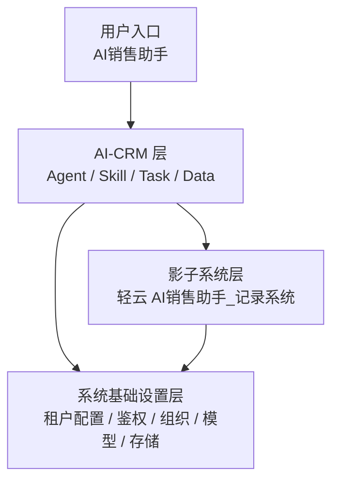
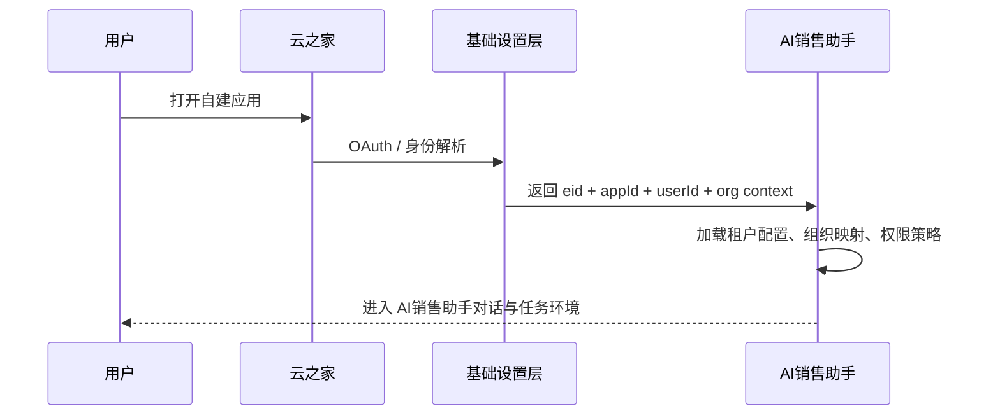

# 系统分层与基础设置

## 本篇回答什么问题

本篇回答以下问题：

- 三层逻辑系统如何落地
- 系统基础设置到底配置什么
- EID、APPID、身份解析、组织同步如何成为整套系统的基础
- 哪些配置是租户级，哪些是环境级，哪些是能力级

## 系统总览

三层的关系不是上下级产品关系，而是：

- 基础设置层提供运行条件
- 影子系统层提供结构化主数据
- AI-CRM 层提供对话、分析与编排能力

## 第一层：系统基础设置

### 职责

系统基础设置层负责所有“系统能不能跑、租户能不能隔离、能力能不能调用”的基础条件。

### 必配配置项

#### 1. 租户与应用识别

- `eid`
- `appId`
- `tenantName`
- `appName`
- `enabled`

说明：

- `eid` 是租户隔离主键
- `appId` 是应用实例隔离维度
- 所有数据、任务、缓存、文件路径、索引都必须继承这两个字段

#### 2. 云之家接入配置

- `yzjServerBaseUrl`
- `oauthClientId`
- `oauthClientSecret`
- `oauthRedirectUri`
- `identityResolveMode`
- `identityResolveSecret`

说明：

- 用于换取 token、解析用户身份、识别当前登录用户属于哪个租户和组织

#### 3. 组织同步配置

- `orgSyncEnabled`
- `orgSyncMode`
- `orgSyncCron`
- `orgRootDeptId`
- `orgUserFilterRule`
- `orgRoleMappingRule`

说明：

- 默认支持首次全量 + 后续增量
- 同步的核心目标是把组织与人员映射到 AI销售助手的可用身份体系中

> `0.2.0` 当前实现口径：
> 先只交付“手动触发的一次性全量在职人员同步”。
> 当前不启用 `orgSyncCron`，也不落地增量同步、部门同步、角色同步和上下级关系同步。

#### 4. 影子系统配置

- `lightCloudAppId`
- `lightCloudAppSecret`
- `lightCloudSecret`
- `shadowObjectFormCodeIds`
- `shadowDictionarySource`
- `shadowDictionaryJsonPath`
- `lightCloudSkillRefreshPolicy`

说明：

- 这些配置用于发现轻云对象、字段和规则，并生成记录系统技能

> `0.2.8` 当前实现口径：
> `admin-api` 已先接入客户对象的 `formCodeId -> 审批模板 -> 标准化字段 -> SKILL bundle 生成 -> 真实 search/get + preview write` 链路。
> refresh 后会在仓库 `skills/shadow` 下生成真实 `SKILL.md + references` 产物。
> 客户详情读取与更新写入链路当前只接受 `formInstId`，不再兼容 `recordId`。
> shadow 持久化按奥坎剃刀原则收敛为“对象注册表 + 对象快照”，skill 契约与字典绑定不再拆独立运行时表。
> `customer_update` 已新增真实 `execute/upsert` 写入能力，调用前仍应先完成 preview 与显式确认。
> 公共选项字段支持 `manual_json`、`approval_api`、`hybrid` 三种字典来源配置，当前优先以本地 JSON 码表接入。
> 人员字段当前统一以云之家人员 `open_id` 作为技能输入语义；附件字段与缺少 `referId` 的省/市/区公共选项字段暂只保留在模板引用资源中，不进入技能可写参数。

#### 5. 模型与 AI 配置

- `llmProvider`
- `llmModel`
- `embeddingProvider`
- `embeddingModel`
- `llmApiKey`
- `llmBaseUrl`
- `promptVersion`

说明：

- 所有模型能力都应支持租户级配置，但运行时可落到平台默认值

#### 6. 录音转写配置

- `transcriptionProvider`
- `transcriptionAppId`
- `transcriptionApiKey`
- `speakerDiarizationEnabled`
- `audioCacheEnabled`
- `transcriptRetentionDays`

说明：

- v1 录音导入是核心场景，因此它不是后置能力，而是基础设置的一部分

#### 6.1 录音联系人候选能力

- `contactCandidateEnabled`
- `contactCandidateProvider`
- `contactCandidateSchemaVersion`

说明：

- 录音联系人补充设计依赖通义服务在转写与摘要之外，额外输出联系人候选
- 当前至少需要返回：
  - 姓名
  - 职位
  - 电话
- 这是录音联系人补充设计成立的前置能力，但不属于 `AI销售助手` 自身的结构化写能力

#### 7. 外部研究配置

- `researchSearchProvider`
- `researchSearchApiKey`
- `researchFetchPolicy`
- `researchSourceWhitelist`
- `researchSnapshotTTL`

说明：

- 公司分析依赖外部检索和研究，因此研究配置也属于基础能力

#### 8. 存储配置

- `primaryDbType`
- `vectorIndexType`
- `objectStorageProvider`
- `objectStorageBucket`
- `redisEnabled`
- `fileRetentionPolicy`

说明：

- 当前阶段性推荐是 `PostgreSQL + pgvector + Object Storage + Redis`
- 同时在数据架构文档中保留 `MongoDB + 向量数据库` 对比与决策门

#### 9. 可观测性配置

- `otelEnabled`
- `otelEndpoint`
- `langfuseEnabled`
- `langfusePublicKey`
- `langfuseSecretKey`
- `traceSamplingRate`

#### 10. 安全与运营配置

- `writeConfirmPolicy`
- `dangerousSkillPolicy`
- `auditRetentionDays`
- `crossTenantAccessPolicy`
- `taskRetryPolicy`

## 第二层：影子系统层

### 职责

影子系统层负责承载结构化主数据，但不承担 AI 主入口体验。

### 对 AI销售助手 的意义

影子系统不是“另一个产品”，而是：

- 主数据事实来源
- 记录技能生成来源
- 写操作回写目标
- 基础查询数据源

### v1 只打通四类对象

- 客户
- 联系人
- 商机
- 商机跟进记录

其他对象只保留扩展位，不进入 v1 必交付。

## 第三层：AI-CRM 层

### 职责

AI-CRM 层负责：

- 主 Agent 路由
- Tool Registry
- 记录系统动态技能
- 场景技能
- 对话层
- 任务系统
- 非结构化数据
- 检索与问答
- 可观测性与审计

### 核心原则

1. 不篡改主数据边界
2. 不跳过写操作确认
3. 不把非结构化数据仅做临时结果
4. 不把对话层和技能层耦死在某一种底层数据库上

## 身份链路设计

### 最小身份上下文

运行时最小上下文统一为：

- `eid`
- `appId`
- `userId`
- `orgId`
- `deptId`
- `roleCodes`

这套上下文必须能贯穿：

- 技能调用
- 数据查询
- 任务执行
- 审计事件
- 观测追踪

## 配置分层

### 环境级配置

适用于整个平台环境：

- 对象存储桶
- OTEL 基础地址
- Redis 基础配置
- 默认模型供应商

### 租户级配置

适用于 `eid + appId`：

- OAuth 配置
- 组织同步规则
- 研究源白名单
- 写操作策略
- 存储保留策略

### 能力级配置

适用于单个技能或单类场景：

- 是否启用录音导入
- 是否启用公司分析
- 是否自动触发客户研究
- 是否允许后台刷新研究快照

## 本篇结论

系统基础设置不是一个附属页面，而是整个 AI销售助手 是否可租户化、可集成、可审计、可扩展的根。

后续设计默认建立在以下前提之上：

- 身份先于技能
- 配置先于场景
- 租户边界先于数据
- 安全约束先于 AI 执行
