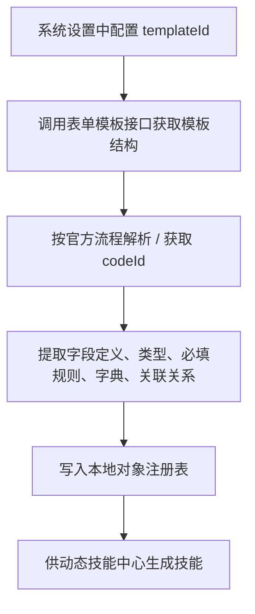
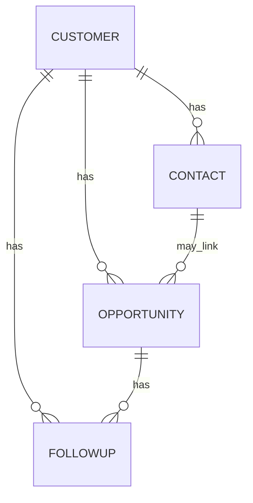

# 影子系统与核心对象设计

## 本篇回答什么问题

本篇回答以下问题：

- 影子系统到底承载哪些对象
- 四个核心对象之间的关系如何设计
- 这些对象的字段和 codeId 应该从哪里获取，而不是靠文档推测
- 为什么 v1 先聚焦这四类对象

## 影子系统定位

影子系统是 `AI销售助手_记录系统` 在云之家轻云中的结构化主数据底座。

它的职责是：

- 承载标准化业务对象
- 作为 CRUD 记录技能的事实来源
- 承接 AI 确认后的写操作回写
- 提供基础查询结果

它不承担：

- 主对话入口
- 复杂编排
- 非结构化分析持久化
- 研究快照持久化

## 字段真值来源原则

本篇中的对象名称和业务关系可以依据截图与业务理解确认，但**字段定义、表单 codeId、模板结构都不能由文档人工猜测**。

对于 `AI销售助手_记录系统`，字段真值来源必须统一为：

1. 系统设置中配置的模板标识
2. 云之家官方 API 返回的表单模板结构
3. 云之家官方 API 返回的表单 codeId / 表单定义

这意味着：

- 文档可以定义“对象范围”和“字段类别”
- 文档不应把截图中的字段直接当成最终 schema
- 最终可写字段、必填字段、字段类型、字段编码、枚举字典，必须以运行时拉取结果为准

## 模板 ID 与 codeId 的配置口径

### 模板 ID

模板 ID 不应写死在场景技能或记录系统技能中，而应在系统基础设置层按租户配置。

建议在系统设置中维护如下映射：

| 业务对象 | 配置项 |
|------|------|
| 客户 | `customer.templateId` |
| 联系人 | `contact.templateId` |
| 商机 | `opportunity.templateId` |
| 商机跟进记录 | `followup.templateId` |

### codeId

`codeId` 也不应人工维护为静态常量。它应通过官方文档所示流程动态获取，并在本地做缓存。

本文档引用以下官方入口作为权威来源：

- 轻云文档中“如何获取表单 codeId”：
  <https://open.yunzhijia.com/opendocs/docs.html#/server-api/business/lightcloud?id=_2%e5%a6%82%e4%bd%95%e8%8e%b7%e5%8f%96%e8%a1%a8%e5%8d%95codeid>
- 审批 / 表单模板文档中“获取表单模板接口”：
  <https://open.yunzhijia.com/opendocs/docs.html#/server-api/business/cloudflow?id=_1%e8%8e%b7%e5%8f%96%e8%a1%a8%e5%8d%95%e6%a8%a1%e6%9d%bf%e6%8e%a5%e5%8f%a3>

## 元数据发现流程

### 运行时约束

- 如果模板接口未取到数据，则该对象不能进入技能生成流程
- 如果 codeId 未成功解析，则该对象只能保留为“未就绪”，不能对 AI 开放写能力
- 所有缓存结果都必须带版本或更新时间，以支持模板变更后的刷新

## v1 核心对象清单

### 1. 客户

客户是 AI销售助手 的一级业务实体，是后续联系人、商机、跟进、公司研究、拜访材料的锚点对象。

#### 字段来源说明

客户对象的最终字段清单必须来自：

- 系统设置中的 `customer.templateId`
- 官方模板接口返回的字段定义
- 官方流程获取到的 `customer.codeId`

#### 本篇只定义字段类别，不定义最终字段清单

客户对象至少应存在以下字段类别：

- 主键 / 编码类
- 名称类
- 状态类
- 归属人与组织类
- 联系方式类
- 行业与区域类
- 最近跟进与来源类

这些类别最终映射到哪些具体字段、字段编码叫什么、是否必填，全部以 API 返回为准。

### 2. 联系人

联系人是客户的从属实体，但在 AI-CRM 中还会被扩展为“可被画像、可形成关系边”的实体。

#### 字段来源说明

联系人对象的最终字段清单必须来自：

- 系统设置中的 `contact.templateId`
- 官方模板接口返回的字段定义
- 官方流程获取到的 `contact.codeId`

#### 本篇只定义字段类别

联系人对象至少应覆盖以下字段类别：

- 主键 / 编码类
- 所属客户关联类
- 姓名类
- 联系方式类
- 职务与角色类
- 地址类
- 启用状态类

### 3. 商机

商机是销售推进的主线对象，也是后续 6 要素分析、拜访策略、风险识别的重要锚点。

#### 字段来源说明

商机对象的最终字段清单必须来自：

- 系统设置中的 `opportunity.templateId`
- 官方模板接口返回的字段定义
- 官方流程获取到的 `opportunity.codeId`

#### 本篇只定义字段类别

商机对象至少应覆盖以下字段类别：

- 主键 / 编码类
- 标题类
- 客户 / 联系人关联类
- 商机来源与类型类
- 销售负责人类
- 竞争与项目背景类
- 阶段与时间类
- 金额 / 预算类

### 4. 商机跟进记录

跟进记录承接销售每一次实际动作，是录音导入最直接的回写目标。

#### 字段来源说明

商机跟进记录对象的最终字段清单必须来自：

- 系统设置中的 `followup.templateId`
- 官方模板接口返回的字段定义
- 官方流程获取到的 `followup.codeId`

#### 本篇只定义字段类别

跟进记录对象至少应覆盖以下字段类别：

- 主键 / 编码类
- 标题类
- 客户 / 商机 / 联系人关联类
- 跟进责任人与方式类
- 跟进时间类
- 跟进内容类
- 客户状态 / 联系人层级类
- 下一步动作类

## 对象关系设计

### 关系解释

- 客户是最上层业务对象
- 联系人从属于客户，但也可以被商机关联
- 商机必须关联客户，可选关联核心联系人
- 跟进记录可以挂在客户上，也可以进一步挂到商机上

## 为什么 v1 只先做这四类对象

原因有三个：

1. 这四类对象足以承载销售高频工作流
2. 它们能够闭环支撑录音导入、公司分析、准备拜访材料
3. 继续把报价、订单、审批等放进 v1，会让动态技能生成和写操作确认复杂度急剧增加

## 字段分层原则

以下分层原则用于“系统通过 API 拉到真实字段后，如何判断这些字段的 AI 开放边界”，而不是用于人工先写死字段。

### 一类：AI 可直接写入字段

满足以下条件的字段可开放给 AI 在确认后写入：

- 用户能明确表达
- 业务语义稳定
- 可做基础校验
- 风险相对可控

例如：

- 名称类字段
- 基础状态字段
- 联系方式字段
- 标题字段
- 跟进方式字段
- 跟进内容字段

### 二类：系统自动生成字段

由影子系统自动生成或平台控制的字段，不应由 AI 主动写：

- 编号
- 创建时间
- 更新时间
- 提交人
- 系统主键

### 三类：AI 只读或受限字段

满足以下条件的字段应只读或受限：

- 涉及审批或财务
- 影响关键业务状态
- 需要组织权限强约束

例如：

- 负责人与组织字段
- 是否分配字段
- 审批状态字段
- 受控业务标签字段

## 与截图对应的设计结论

根据用户提供的截图，可以得到以下 v1 结论，但这些结论只用于确认对象范围与业务语义，不用于确认最终字段 schema：

### 客户对象

- 采用“列表 + 表单详情页”的标准模式
- 可确认客户对象存在状态类、类型类、负责人类等结构化字段类别
- 客户详情页已具备可扩展为“跟进记录 / 合同 / 智能分析”多 tab 的空间

### 联系人对象

- 联系人天然与客户绑定
- 可确认联系人对象至少存在启用状态、职务、称谓、联系方式等字段类别
- 这使得联系人不仅可做 CRUD，也适合作为 AI-CRM 中的画像实体

### 商机对象

- 可确认商机对象至少存在客户、联系人、商机来源、销售负责人等字段类别
- 这为商机 6 要素分析提供了结构化基础入口

### 商机跟进记录对象

- 可确认跟进记录对象至少存在跟进方式、跟进时间、跟进内容、联系人层级等字段类别
- 是录音导入场景的最佳回写目标

## 影子系统的 AI 开放边界

v1 对 AI 开放的默认能力边界如下：

### 默认开放

- 创建客户
- 查询客户
- 更新客户的基础字段
- 创建联系人
- 查询联系人
- 更新联系人基础字段
- 创建商机
- 查询商机
- 更新商机基础字段
- 创建商机跟进记录
- 查询商机跟进记录

### 默认不开放

- 删除对象
- 审批流推进
- 高风险状态变更
- 订单、报价、合同链路写入

## 本篇结论

v1 的影子系统不是“先根据截图写字段清单”，而是：

1. 先在系统设置层配置模板 ID
2. 再通过官方模板接口与 codeId 获取流程发现真实 schema
3. 最后把这些真实 schema 交给动态技能中心生成能力

因此必须坚持四条原则：

1. 客户是一级锚点对象
2. 商机跟进记录是录音导入的标准回写目标
3. 模板 ID 通过系统设置配置，不写死在文档或代码常量中
4. 字段、codeId、必填规则、枚举字典一律以 API 返回为准
