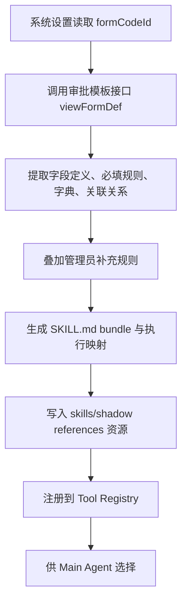

# 记录系统动态技能中心

## 本篇回答什么问题

本篇回答以下问题：

- 如何从轻云记录系统动态生成可被 AI 使用的“记录系统技能”
- 系统具体如何通过模板接口和 codeId 获取流程生成类似“客户录入”这样的 SKILL
- 动态技能的能力边界是什么
- 如何保证这类技能严谨、可审计、可回放
- 为什么 v1 不直接开放所有轻云对象和所有 CRUD

## 核心目标

记录系统技能中心的目标是：

把轻云 `AI销售助手_记录系统` 中的结构化对象和字段定义，转化为 `AI销售助手` 可理解、可选择、可安全执行的技能集合。

这类技能本质上是：

- 强结构化
- 严约束
- 面向写入确认
- 面向主数据回写

它们和场景技能最大的区别是：

- 记录系统技能直接面向结构化主数据对象
- 场景技能负责编排、分析和产物生成

> `0.2.8` 当前实现口径：
> 后端首轮只激活 `customer` 对象。
> 当前以 `formCodeId` 作为运行时对象锚点，通过审批 `viewFormDef` 读取模板结构，在 `admin-api` 中生成 `shadow.customer_search`、`shadow.customer_get`、`shadow.customer_create`、`shadow.customer_update` 四个客户技能 bundle。
> 每个 bundle 都会落地真实 `SKILL.md`、`agents/openai.yaml` 与 `references/*` 资源。
> 其中 `shadow.customer_search`、`shadow.customer_get` 已支持轻云 `searchList` / `data/list` 真实读取；详情读取与更新统一使用 `formInstId`；`shadow.customer_update` 已支持真实 `batchSave` 写入。
> 运行时存储已简化为“对象注册表 + 对象快照”，字典绑定直接内聚在快照中，skill bundle 由快照实时生成。
> 本轮进一步收口字段规则：人员字段按 `open_id` 输入，附件字段与缺少 `referId` 的省/市/区字段只保留在模板 references 中，不再进入技能自动合同，也不会阻塞 preview / live 调用。

## 动态技能生成来源

记录系统技能不靠手写维护，而从以下来源动态生成：

1. 系统设置中配置的对象 `formCodeId`
2. 官方模板接口返回的表单模板结构
3. 运行时补充的对象字段规则与公共选项字典
4. 模板接口返回的字段定义
5. 字段必填规则、字典规则、关联关系
6. 管理员补充规则

本文档引用以下官方入口作为权威来源：

- 轻云“如何获取表单 codeId”：
  <https://open.yunzhijia.com/opendocs/docs.html#/server-api/business/lightcloud?id=_2%e5%a6%82%e4%bd%95%e8%8e%b7%e5%8f%96%e8%a1%a8%e5%8d%95codeid>
- 审批 / 表单“获取表单模板接口”：
  <https://open.yunzhijia.com/opendocs/docs.html#/server-api/business/cloudflow?id=_1%e8%8e%b7%e5%8f%96%e8%a1%a8%e5%8d%95%e6%a8%a1%e6%9d%bf%e6%8e%a5%e5%8f%a3>

### 管理员补充规则

仅靠轻云元数据不足以让 AI 稳定使用，还必须提供一层“管理规则补充”：

- 哪些字段 AI 可写
- 哪些字段 AI 只读
- 哪些字段需要确认
- 哪些相似字段应避免混淆
- 哪些对象当前对 AI 禁用

## v1 支持的技能类型

v1 只生成以下几类技能：

- `create`
- `get`
- `search`
- `update`
- `list_related`
- `append_record`

其中：

- `append_record` 主要用于跟进记录这类附加型对象
- `delete` 默认不对 AI 开放

## 先有对象注册，再有技能生成

为了让动态技能生成可控，系统必须先建立“对象注册表”。

### 对象注册表示例

| 业务对象 | 系统设置项 | 说明 |
|------|------|------|
| 客户 | `customer.formCodeId` | 租户配置的客户表单 codeId |
| 联系人 | `contact.formCodeId` | 租户配置的联系人表单 codeId |
| 商机 | `opportunity.formCodeId` | 租户配置的商机表单 codeId |
| 商机跟进记录 | `followup.formCodeId` | 租户配置的跟进记录表单 codeId |

对象注册表中不直接写最终字段，而是保存：

- 业务对象名
- `formCodeId`
- 最近一次审批模板快照版本
- 最近一次模板版本摘要
- 启停状态

## 技能 bundle 统一契约

每个动态生成的记录系统技能都必须具备统一 bundle 契约，并且真正落成技能目录。

### 最小契约字段

| 字段 | 说明 |
|------|------|
| `skill_name` | 技能唯一标识 |
| `description` | 技能做什么 |
| `when_to_use` | 什么时候应该使用 |
| `not_when_to_use` | 什么时候不应误用 |
| `required_params` | 必填参数 |
| `optional_params` | 可选参数 |
| `confirmation_policy` | 是否需要确认 |
| `output_card_type` | 前端展示卡片类型 |
| `source_object` | 对应轻云对象 |
| `source_form_code_id` | 对应轻云表单 codeId |
| `source_version` | 对应对象元数据版本 |
| `skill_path` | 生成的 `SKILL.md` 路径 |
| `reference_paths` | 生成的模板与执行引用资源 |

### 示例

```json
{
  "skill_name": "shadow.customer_create",
  "description": "在轻云记录系统中创建客户",
  "when_to_use": "当用户明确要录入客户、创建客户、补录客户时使用",
  "not_when_to_use": "当用户只是查询客户情况或分析公司时不要使用",
  "required_params": ["customer_name"],
  "optional_params": ["customer_status", "industry", "phone"],
  "confirmation_policy": "required_before_write",
  "output_card_type": "customer-create-preview",
  "source_object": "customer",
  "source_form_code_id": "e2cfd2aef9bf4576a760aa1c6a557170",
  "source_version": "2026-04-23T09:00:00.000Z",
  "skill_path": "skills/shadow/customer/create/SKILL.md"
}
```

## 记录系统技能生成流程



### 步骤说明

#### Step 1：从系统设置读取 formCodeId

系统不应扫描所有轻云对象后再盲目开放，而应先读取租户配置中已启用的对象 `formCodeId`。

例如：

- `customer.formCodeId`
- `contact.formCodeId`
- `opportunity.formCodeId`
- `followup.formCodeId`

#### Step 2：调用官方模板接口

系统根据 `formCodeId` 调用官方表单模板接口，拿到：

- 模板结构
- 字段定义
- 字段类型
- 是否必填
- 默认值
- 字典候选
- 关联关系

这里的关键结论是：

> 字段定义来自 API 返回，不来自文档推测。

#### Step 3：补齐字典与字段可用性规则

对于普通单选 / 多选控件，可直接使用模板返回的选项。
对于公共选项控件 `publicOptBoxWidget`，系统必须补齐 `referId` 对应的枚举来源，再决定是否把该字段暴露给技能参数。

当前实现支持：

- `manual_json`：本地 JSON 码表
- `approval_api`：审批公共选项接口
- `hybrid`：先本地 JSON，未命中再走审批接口

若公共选项字段未解析到码表：

- 字段仍保留在对象元数据中
- 默认不进入自动生成的 `required_params`
- preview 时只接受完整 `{title, dicId}`，不接受 title-only 自动猜测

若公共选项字段连 `referId` 都缺失：

- 当前按“不可稳定执行”处理
- 字段仍保留在 `template-summary` / `template-raw` / `dictionaries` references 里供人工核对
- 不进入自动生成的技能参数
- preview 与 live 执行收到这类字段时直接忽略，不再报只读或缺码表错误

#### Step 4：抽取可 AI 使用的字段

过滤掉以下字段：

- 系统自动生成字段
- 审批和危险字段
- 强人工判断字段
- 对当前对象无业务意义的冗余字段

#### Step 5：叠加管理员规则

管理员规则负责把“数据库字段”转成“AI 能用的技能语义”。

例如：

- 哪个字段是“客户名称”语义主字段
- 哪个字段允许 AI 回写
- 哪个字段必须写前确认
 - 哪个人员字段应统一按 `open_id` 输入
- 哪个字段要用字典映射而不是自由文本

#### Step 6：生成技能 bundle 并注册

注册结果包括：

- 技能名称
- 技能说明
- 输入 schema
- 输出卡片类型
- 确认策略
- 版本信息
- `SKILL.md` 路径
- `references/` 路径

此外还要生成执行映射：

- 该技能对应哪个业务对象
- 该对象当前使用哪个 `formCodeId`
- 技能入参如何映射到轻云实例写入 payload

## 客户录入 SKILL 的生成示例

下面以“客户录入”举例说明整个过程。

### Step A：配置对象

租户管理员在系统设置中配置：

```yaml
shadow_objects:
  customer:
    formCodeId: "e2cfd2aef9bf4576a760aa1c6a557170"
    enabled: true
```

### Step B：拉取模板

系统基于 `customer.formCodeId` 调用官方模板接口，拿到客户表单的真实字段结构。

### Step D：标准化字段模型

系统将 API 返回字段归一化为内部结构：

```json
{
  "objectKey": "customer",
  "formCodeId": "e2cfd2aef9bf4576a760aa1c6a557170",
  "fields": [
    {
      "fieldCode": "Te_0",
      "label": "客户名称",
      "widgetType": "textWidget",
      "required": true,
      "readOnly": false,
      "semanticSlot": "customer_name"
    }
  ]
}
```

注意：

- 这里的字段名只是说明结构，不代表真实字段编码
- 真实字段编码必须以 API 返回为准

### Step E：生成客户录入技能 bundle

系统生成类似以下技能：

```json
{
  "skill_name": "shadow.customer_create",
  "description": "在轻云记录系统中创建客户",
  "when_to_use": "当用户明确要录入客户、创建客户、补录客户时使用",
  "not_when_to_use": "当用户只是查询客户情况或分析公司时不要使用",
  "required_params": ["由 API 返回的必填字段推导"],
  "confirmation_policy": "required_before_write",
  "output_card_type": "customer-create-preview",
  "source_object": "customer",
  "source_form_code_id": "e2cfd2aef9bf4576a760aa1c6a557170",
  "source_version": "2026-04-23T09:00:00.000Z",
  "skill_path": "skills/shadow/customer/create/SKILL.md",
  "reference_paths": {
    "template_summary": "skills/shadow/customer/create/references/template-summary.json",
    "template_raw": "skills/shadow/customer/create/references/template-raw.json",
    "dictionaries": "skills/shadow/customer/create/references/dictionaries.json",
    "execution": "skills/shadow/customer/create/references/execution.json"
  }
}
```

### Step F：生成执行器

执行器并不是手写每个对象，而是基于对象注册表和字段映射自动生成：

1. 接收标准化技能参数
2. 转换为轻云实例写入 payload
3. 调用对应表单实例接口
4. 返回预览卡片或写回结果

## 刷新与版本策略

动态技能不是“一次生成永久有效”，而应支持刷新。

### 刷新触发条件

- 系统启动
- 管理员手动刷新
- 模板 ID 被修改
- 模板结构 hash 变化

### 版本记录

每次刷新都应记录：

- `formCodeId`
- 字段结构摘要
- 技能 bundle 版本
- 生成时间
- 技能文件路径与 references 路径

### 公共选项预留

对 `Pw_*` 公共选项字段，标准化结果至少保留：

- `referId`
- `enumBinding.kind=public_option`
- `enumBinding.source`
- `enumBinding.resolutionStatus`
- `enumBinding.acceptedValueShape=array<{title,dicId}>`

只有当码表已解析成功时，系统才允许 title-only 或 dicId-only 自动映射；否则只能透传显式 `{title,dicId}`。

## 严谨性设计

记录系统技能的关键不是“自动生成”，而是“自动生成后仍然足够严谨”。

### 严谨性原则 1：写操作必须确认

所有会写轻云主数据的技能，默认都必须经过确认卡片。

### 严谨性原则 2：字段值必须校验

至少校验：

- 是否缺失必填
- 枚举值是否合法
- 关联对象是否存在
- 是否跨租户引用

### 严谨性原则 3：技能版本可追踪

每次技能调用都要记录：

- 使用的对象版本
- 使用的技能 bundle 版本
- 触发的字段映射规则版本

### 严谨性原则 4：默认不开放删除

删除操作不适合作为 v1 默认 AI 能力。

如后续确需支持，也应走：

- 归档
- 软删除
- 管理员二次确认

而不是普通对话直接删除。

## 与场景技能的关系

记录系统技能是场景技能的底座，但不等于场景技能。

### 记录系统技能

解决：

- 客户怎么建
- 联系人怎么查
- 商机怎么更新
- 跟进记录怎么写回

### 场景技能

解决：

- 录音导入后如何生成候选跟进记录
- 公司分析如何形成研究快照
- 准备拜访材料如何组合多源输入

## 本篇结论

记录系统动态技能中心是 `AI销售助手` 把轻云影子系统变成 AI 可执行能力的关键桥梁。

它的价值不在“自动生成了多少技能”，而在：

- 让轻云对象对 AI 可发现
- 让 AI 写结构化主数据时足够严谨
- 让后续场景技能可以稳定复用这套能力
- 让模板 ID、codeId、字段定义都来自官方 API，而不是人工维护猜测稿
