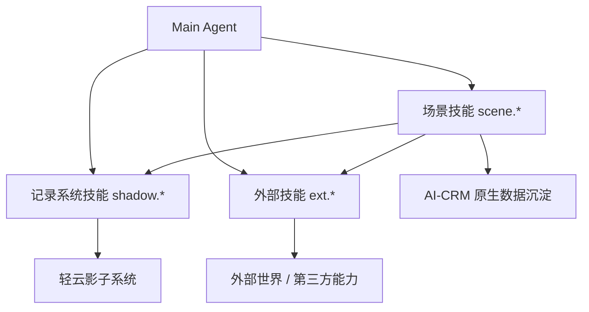

# 场景技能总览与编排原则

## 本篇回答什么问题

本篇回答以下问题：

- 什么叫“场景技能”
- 场景技能、记录系统技能、外部技能如何分工
- 联网搜索、公司分析、PPT 生成这类能力应该放在哪一层
- 0.4.3 起为什么改成“复合场景 + 分析场景”两层结构
- 场景技能在编排时要遵循哪些共同原则

## 0.4.3 补充口径

自 `0.4.3` 起，场景技能的对外表达不再收敛为“录音导入与拜访分析 + 准备拜访材料”两个名字，而是改成两层结构：

### 1. 复合场景

- `scene.post_visit_loop`
- 中文名：`拜访后闭环`

它面向真实拜访后的 mp3、纪要和结果收口，负责：

- 识别客户 / 商机上下文
- 补齐或复用客户、商机
- 创建跟进记录
- 继续组装下游分析场景

- `scene.solution_expert_enablement`
- 中文名：`方案匹配与专家协同`

它面向方案推进阶段，负责：

- 承接问题陈述和客户价值定位
- 匹配内部方案知识条目
- 筛选可复用案例
- 组织专家协同资源

### 2. 分析场景

- `scene.customer_analysis`
- `scene.conversation_understanding`
- `scene.needs_todo_analysis`
- `scene.problem_statement`
- `scene.value_positioning`

这 5 个场景既可以：

- 被 `/客户分析`、`/拜访会话理解` 这类 slash 命令单独访问

也可以：

- 被 `scene.post_visit_loop` 作为子场景自动组装

### 3. “客户分析”与“公司分析”的关系

- `客户分析` 是场景技能
- `公司分析 / company-research` 是外部技能供给
- 前者负责围绕客户目标组织主数据、关系人、商机和研究输入
- 后者只负责补充公开研究和背景来源

## 当前收敛结论

本轮文档中需要先明确一个口径：

- `公司分析` 指的是外部技能
- 该能力当前对应的是外部技能 `company-research-pm`
- 它的最小输入是 `companyName`
- 它不等于 CRM 业务场景

如果未来要做“围绕客户绑定、研究快照沉淀、后台刷新、版本治理、后续复用”的完整业务能力，应单独命名为：

- `公司深度分析`

但这个能力暂不纳入当前 v1 范围。

## 能力分层总览

从业务能力角度，`AI销售助手` 的技能体系当前分为三类：

- 记录系统技能
- 场景技能
- 外部技能

其中：

- 记录系统技能解决“结构化对象如何查和写”
- 场景技能解决“一个业务目标如何完成”
- 外部技能解决“如何连接外部世界或调用通用能力”

### 记录系统技能 vs 场景技能 vs 外部技能

| 维度 | 记录系统技能 | 场景技能 | 外部技能 |
|------|-------------|---------|---------|
| 核心职责 | 对结构化主数据做 CRUD/查询 | 编排多个步骤完成业务目标 | 提供联网、研究、转写、抓取、导出等通用能力 |
| 是否直接对应业务目标 | 否 | 是 | 通常否 |
| 主要数据来源 | 轻云对象 | 轻云 + AI 原生数据 + 外部技能 | 第三方服务、外部网页、生成引擎 |
| 产物类型 | 写入预览、查询卡片 | 分析卡片、任务结果、候选写回 | 搜索结果、研究简报、转写文本、导出文件 |
| 风险重点 | 写错主数据 | 编排失控、上下文不完整 | 来源质量、时延、成本、可替换性 |
| 典型示例 | `shadow.customer_create` | `scene.post_visit_loop` | `ext.company_research_pm` |

## 三类能力的定义

### 1. 记录系统技能

记录系统技能面向轻云影子系统的结构化对象。

例如：

- `shadow.customer_create`
- `shadow.customer_query`
- `shadow.contact_create`
- `shadow.opportunity_update`
- `shadow.followup_record_create`

它的本质是：

- 查结构化主数据
- 写结构化主数据
- 严格遵守字段、权限、确认和审计约束

### 2. 场景技能

场景技能是指：

围绕一个完整业务目标，把多步取数、分析、判断、生成、回写确认串联起来的高阶能力。

它不直接等同于某一个数据库操作，也不直接等同于某一个外部能力。

当前原型中的核心场景技能收敛为：

- 2 个复合场景：`scene.post_visit_loop`、`scene.solution_expert_enablement`
- 5 个分析场景：`scene.customer_analysis`、`scene.conversation_understanding`、`scene.needs_todo_analysis`、`scene.problem_statement`、`scene.value_positioning`

### 3. 外部技能

外部技能是指：

不直接承载 CRM 主业务语义，但为 Main Agent 或场景技能提供外部连接和通用处理能力的一组能力接口。

它们通常具备以下特点：

- 能被多个场景重复复用
- 对外部服务或外部世界有依赖
- 本身不拥有客户、商机、跟进等业务主语义
- 输出更像中间材料、研究结果或导出物

## 当前文档中的“公司分析”如何定义

当前文档中的 `公司分析`，指的是外部技能，而不是场景技能。

建议在 Tool Registry 中以如下方式纳入：

- `ext.company_research_pm`

它的典型输入是：

- `companyName`

可选补充输入可以有：

- `researchGoal`
- `industryHint`

但核心输入仍然是公司名称。

### 这个外部技能的定位

它更接近：

- 企业研究能力
- 公开资料整合能力
- 面向产品/战略视角的研究简报生成能力

而不是：

- 客户绑定后的 CRM 深度研究场景
- 研究快照版本治理场景
- 后台长任务编排场景

### 为什么它属于外部技能

因为它当前的工作方式是：

- 输入一个公司名称
- 从公开来源收集资料
- 生成一份企业研究简报

它没有天然要求：

- 绑定客户实体
- 绑定商机
- 写回影子系统
- 建立任务状态机
- 生成企业级研究快照体系

因此当前更合理的归类是外部技能。

## 哪些能力属于外部技能，哪些不属于

### 联网搜索属于外部技能

例如：

- `ext.web_search`
- `ext.web_fetch_extract`

它本质是通用能力，不天然带业务实体绑定。

### 公司分析属于当前 v1 的外部技能

即：

- `ext.company_research_pm`

它可以被用户直接调用，也可以被其他场景作为外部能力复用。

### PPT 生成属于外部技能

例如：

- `ext.super_ppt`

它本质是结果包装和导出，不是 CRM 场景本身。

### 录音导入不是外部技能

虽然它依赖外部转写能力，但：

- `ext.audio_transcribe` 是外部技能
- `scene.audio_import` 是场景技能

前者解决“把音频转成文本”，后者解决“如何补齐客户与商机上下文、创建商机跟进记录，并把录音沉淀为可复用分析资产”。

### 录音上传三类拜访逻辑属于一个场景技能

当前需要进一步收敛一个口径：

- 首次拜访，无客户无商机
- 已有客户后的首次拜访
- 已有客户、已拜访过多次

这三类情况都属于同一个场景技能：

- `scene.audio_import`

它们不是三个独立场景，而是同一个场景技能在不同上下文成熟度下的三条内部处理分支。

因此不建议拆成：

- `scene.first_visit_audio_import`
- `scene.customer_first_visit_audio_import`
- `scene.repeat_visit_audio_import`

更合理的做法是：

- 对外只有一个场景技能
- 对内通过状态机和 `next_required_action` 推进后续步骤

## 当前不纳入的未来场景

如果未来要把“公司分析”升级为真正的业务场景，应另起名为：

- `scene.company_deep_analysis`

这个未来场景可能会包含：

- 绑定客户实体
- 生成研究快照
- 管理新鲜度和版本
- 支持后台刷新
- 供拜访准备、问答、风险分析复用

但这不是当前 v1 范围，因此本篇不展开设计。

## v1 核心场景技能

### 1. 录音导入与拜访分析

目标：

- 接收销售导入的录音
- 补齐客户与商机上下文
- 创建一条商机跟进记录
- 把录音作为该跟进记录附带的非结构化内容沉淀到 AI-CRM
- 在跟进记录创建完成后异步执行转写与分析
- 把分析结果沉淀到 AI-CRM 原生层供后续复用

它通常会依赖的外部技能包括：

- `ext.audio_transcribe`
- `ext.audio_diarize`

### 录音导入的内部三条分支

`scene.audio_import` 内部至少要覆盖三条上下文分支：

#### 1. 无客户无商机

- 先建客户
- 再建商机
- 再建商机跟进记录
- 跟进记录创建成功后再启动录音分析

#### 2. 有客户无商机

- 复用已有客户
- 默认建议创建商机
- 商机创建后立即创建商机跟进记录
- 跟进记录创建成功后再启动录音分析

#### 3. 有客户有商机 / 多商机待选择

- 若已有唯一明确商机，则可直接预填
- 若存在多个商机，则必须澄清选择
- 若当前没有合适商机，则先建商机再建跟进记录
- 跟进记录创建成功后再启动录音分析

### 录音导入的分层边界

在这个场景里：

- `scene.audio_import` 负责总编排与状态推进
- `shadow.customer_*` 负责客户结构化操作
- `shadow.opportunity_*` 负责商机结构化操作
- `shadow.followup_record_create` 负责正式写入商机跟进记录
- 通义 Agent 只负责录音分析，不负责客户、商机、跟进记录创建

### 2. 准备拜访材料

目标：

- 消费影子系统主数据
- 消费历史录音与跟进分析
- 按需补充公司公开信息
- 生成拜访前简报、关键问题、风险与行动建议

它通常会依赖的外部技能包括：

- `ext.company_research_pm`
- `ext.super_ppt`

但需要强调：

v1 的标准输出仍不是 PPT，而是：

- 拜访摘要卡片
- Markdown 一页简报
- 建议问题
- 风险与行动建议

PPT 生成只作为扩展导出能力预留，不作为 v1 标准交付物。

## v1 重要外部技能

当前 v1 建议优先纳入以下外部技能：

- `ext.image_generate`
- `ext.company_research_pm`
- `ext.web_search`
- `ext.web_fetch_extract`
- `ext.audio_transcribe`
- `ext.super_ppt`

## v1 外部技能实现策略

为了先把系统完整跑起来，当前 v1 不追求所有外部技能都接入真实能力。

阶段性实现策略如下：

- `scene.audio_import` 相关的音频分析链路，优先接入已有的通义 Agent 服务
- `ext.image_generate` 先以 `http_request provider` 真实接入
- 其他外部技能先统一走 `mock provider`
- 先跑通 Main Agent -> Tool Registry -> Skill -> Task -> Data -> Confirm 的完整主链路
- 等主链路稳定后，再逐步把 mock provider 替换成真实 provider

### 当前 provider 分工

#### 1. 录音导入

当前走：

- `tongyi_agent_provider`

原因是：

- 这是当前已有能力
- 录音导入是 v1 核心场景
- 它比公司分析、PPT 导出更影响主链路是否能跑通

#### 2. 其他外部技能

当前先走：

- `mock_provider`

适用对象包括：

- `ext.company_research_pm`
- `ext.web_search`
- `ext.web_fetch_extract`
- `ext.super_ppt`

### 为什么先用 mock

这样做的目标不是“长期依赖 mock”，而是先验证以下事情：

- Tool Registry 是否稳定
- Main Agent 是否能正确选技能
- 场景技能是否能消费外部技能结果
- 任务状态、卡片、确认写回、资产沉淀是否完整

也就是说，当前 v1 的重点是：

- 跑通系统
- 跑通数据链路
- 跑通用户体验

而不是先把所有外部 provider 都做深。

### provider 抽象要求

即使当前先走 mock，也不应把 mock 写死在上层逻辑里。

建议统一采用如下思路：

- `skill_code` 不变
- `provider` 可切换
- 输出契约保持一致

例如：

- `ext.image_generate -> http_request_provider`
- `ext.company_research_pm -> mock_provider`
- `ext.audio_transcribe -> tongyi_agent_provider`

后续真实替换时，只切换 provider，不改上层场景编排。

### 公司分析外部技能的直接调用方式

适合直接触发的用户表达例如：

- “分析一下华为”
- “帮我研究一下字节跳动”
- “给我一份这家公司的研究简报”

在这些情况下，Main Agent 可以直接调起：

- `ext.company_research_pm`

而不需要先进入某个复杂场景编排。

## 外部技能如何纳入 v1

外部技能不应游离在体系外，而应正式纳入 `Tool Registry`。

建议命名空间统一采用：

- `shadow.*`：记录系统技能
- `scene.*`：场景技能
- `ext.*`：外部技能

### 纳入原则

#### 1. 场景技能优先负责编排，外部技能负责供能

场景技能负责：

- 识别业务目标
- 组织步骤
- 绑定业务实体
- 管理任务状态
- 沉淀业务资产

外部技能负责：

- 联网获取信息
- 研究公开资料
- 转写和抽取
- 导出交付物

#### 2. 外部技能可以被直接调用，但不替代场景设计

例如：

- “分析一下华为”可以直接调 `ext.company_research_pm`
- “把这份简报导出成 PPT”可以直接调 `ext.super_ppt`

但像：

- “导入这段录音并生成跟进记录”
- “结合历史跟进和外部资料帮我准备拜访材料”

仍应走场景技能。

#### 3. 外部技能不能直接写影子系统主数据

无论是公司分析结果、联网搜索结果、转写结果还是 PPT 生成结果，都不能绕过确认直接成为主数据真相。

#### 4. 外部技能必须可替换

同一类外部技能背后可能切换不同 provider，因此必须做统一契约封装，不能把某个 provider 的接口语义直接暴露到上层。

#### 5. 外部技能结果只有在被场景消费或显式持久化后，才成为业务资产

也就是说：

- 外部技能本身产出的是能力结果
- 是否沉淀为 AI-CRM 长期资产，要由上层策略决定

## 场景技能的编排原则

### 原则 1：场景技能不越权写主数据

场景技能可以：

- 读取影子系统主数据
- 生成候选结果
- 组织回写卡片

但不能绕过确认直接写主数据。

### 原则 2：所有场景都要沉淀可复用资产

场景技能的输出不能只是当次对话结果，还要沉淀为：

- 分析结果
- 任务状态
- 文件元数据
- 实体记忆

### 原则 3：优先绑定客户实体

对当前 v1 场景来说，几乎所有场景最终都应尽量绑定到客户实体。

因为：

- 录音导入最终通常挂到客户或商机
- 拜访材料以客户为主锚点

### 原则 4：支持异步与后台执行

录音导入是明显的异步场景，因此场景技能必须支持：

- 后台任务
- 中途切换话题
- 完成后通知

准备拜访材料在需要补充外部信息时，也可以触发短后台任务。

### 原则 5：产物优先结构化，文件导出放在外部技能层

v1 场景技能的标准输出优先是：

- 卡片
- Markdown 简报
- 结构化摘要

复杂文件输出如 PPT，放在 `ext.super_ppt` 这一类外部技能中处理。

### 原则 6：每个场景都要可解释

系统必须能说明：

- 这次用了哪些输入
- 这些输入来自哪里
- 哪些结果来自外部技能
- 哪些结果是模型生成的
- 哪些结果已写主数据，哪些还只是候选

## 外部技能的最小契约

为了避免后续接第三方能力时越来越乱，建议所有外部技能至少统一以下输出字段：

- `capability_name`
- `provider`
- `implementation_type`
- `status`
- `summary`
- `source_refs`
- `artifact_refs`
- `cost_info`
- `latency_ms`
- `confidence_hint`

这样做的意义是：

- 便于审计
- 便于切换 provider
- 便于上层场景复用
- 便于可观测性统计

## 场景技能公共输入

为便于统一编排，所有场景技能尽量采用统一上下文：

- `eid`
- `appId`
- `userId`
- `threadId`
- `customerId` 或 `customerCode`
- `opportunityId`
- `contactIds`
- `taskId`

并按场景补充：

- 音频文件信息
- 拜访日期与目标

## 场景技能公共输出

所有场景技能的输出都至少包含：

- `task_status`
- `summary`
- `artifact_refs`
- `source_refs`
- `next_actions`
- `writeback_candidates`

## 三类技能的关系

### 关系说明

- 记录系统技能面向影子系统主数据
- 外部技能面向外部世界和通用能力
- 场景技能位于中间，负责把两类能力编排成完整业务闭环

## 本篇结论

当前收敛后的能力口径应是：

1. `shadow.*` 负责结构化主数据操作
2. `scene.*` 负责录音导入、准备拜访材料等业务闭环
3. `ext.*` 负责公司分析、联网搜索、转写、导出等通用外部能力

其中：

- 当前 `公司分析` 属于外部技能
- 它的核心输入是 `companyName`
- 当前不把它定义成场景技能
- 未来如果升级为完整业务能力，再单独设计 `公司深度分析`

这样设计后，技能分层会更稳，后续扩展也不会把“外部研究能力”和“CRM 业务场景能力”混在一起。
