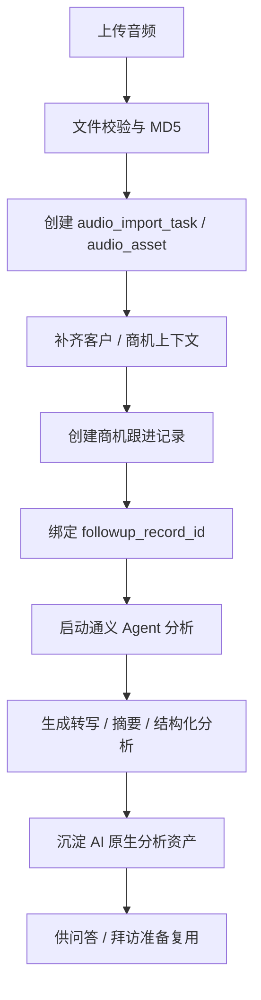

# 录音导入场景设计

## 0.10.23 文档口径变更

自 `0.10.23` 起，录音 MD5 只作为“通义处理底座复用键”，不再作为“业务录音卡片 / 拜访记录 / 下游分析”的幂等键：

- 同一 MD5 录音再次上传时，系统必须创建新的 `recording-task-*` 业务任务，并默认返回 `archive.status = unarchived`，用户端按钮显示“新增拜访记录”。
- 新业务任务可以复用已有通义转写、摘要、章节、关键词、说话人、资料包和回放路径，避免重复消耗录音处理资源。
- 新业务任务不得继承旧任务的 `artifactId`、`archivedArtifactId`、`archivedFollowupId`、`pendingArchive`、正式客户/商机/跟进记录 anchors 或旧下游分析状态。
- 拜访会话理解、客户需求工作待办分析、客户价值定位等下游分析按新业务任务重新发起；点击新卡片上的分析按钮时，生成的新 job 必须绑定新的 `recording-task-*`，历史下游 job 匹配也只能按当前业务 taskId，不能按共享 MD5 或通义 taskId 复用旧分析。
- 若同 MD5 历史任务是失败状态，重传会重新触发通义处理，同时仍创建新的业务任务，不覆盖旧失败卡片。

## 0.9.1 文档口径变更

自 `0.9.1` 起，录音下游分析资料的正式归档不再只依赖用户在录音卡片上点击技能后的同步轮询：

- 录音资料包在创建正式跟进记录后归档为 `recording_material`，随后会自动尝试补归档同一录音任务已经完成的下游分析结果。
- 若创建正式跟进记录时录音任务尚未完成，系统返回 `archive.status = pending`，把 `customer / opportunity / followup / createdBy` 写入待归档 payload；后续 `getTask`、`materializeTask` 或任务状态刷新发现任务完成后，会自动正式归档。
- 补归档只在录音任务已经具备正式 `customer / opportunity / followup` 锚点后执行，生成 `analysis_material`，并使用 `source_file + customer + opportunity + followup` 的 bound anchors。
- 正式归档后只重跑用户已经生成过的下游分析技能，不默认跑完 4 个技能；重跑请求必须携带正式客户、商机、跟进记录锚点，并禁止输出“未关联客户/商机”“未关联商机”“录音未绑定”等旧上下文描述。
- `analysis_material` 入库前会检查 Markdown 头部，若仍包含未关联上下文文案，则阻止保存，避免旧上下文再次污染资料库。
- 下游分析来源优先读取 skill-runtime job 记录；若 job 索引丢失但 `.local/skill-runtime-artifacts` 中仍保留真实 Markdown 产物和输入附件，系统可按录音任务、来源文件、MD5 或正式锚点信号恢复归档。
- `analysis_material` 按技能和正式锚点使用当前版本替换策略，重复回填不会生成同一技能的重复资料。
- 已通过一次性脚本重跑 `recording-task-22e34ce5` 的历史脏数据：覆盖 `拜访会话理解`、`客户需求工作待办分析`、`客户价值定位` 3 份当前分析资料；Mongo 校验确认正文不再残留未关联商机且 Artifact anchors 包含 bound opportunity，脚本执行后已删除。

## 0.9.0 文档口径变更

自 `0.9.0` 起，录音能力改为“内置录音处理服务 + 标准录音资料包”的完整闭环：

- `apps/tongyi-audio-service` 是从 `tongyi-agent` 拷贝进本项目的 Python 独立进程，`admin-api` 只通过 HTTP 调用它。
- 后台不再把录音处理理解为“某个外部技能绑定”，而是在 `系统设置 / 录音处理服务` 展示服务状态、产出资料、可继续使用能力和默认规则。
- 外部技能详情只展示“可使用的上游资料”，例如 `客户需求工作待办分析` 可以使用“录音资料包、客户资料、商机资料”。
- 主 Agent 内核仍保持业务无关，不注册或选择 `scene.*` 运行时技能；录音入口在业务包中以 `artifact.recording_material.prepare` 表达。
- 通义服务解析后的本地产物写入 `tmp/tongyi/<dataId>/`，目录结构与原 `tongyi-agent/outputs/<dataId>/` 保持一致。
- 上传音频只按本服务已完成解析的同 MD5 任务复用，不再映射到某个固定录音 fixture。

### 资料边界

以下文件只作为过程信息保存，默认不进入 Artifact、不进向量索引、不作为对话 Evidence、不直接给下游技能消费：

- `transcription.json`
- `translations.json`
- `textPolish.json`
- `task-result.json`
- `create-task.json`
- `summary.txt`

`summarization.json`、`mindMapSummary.json`、`meetingAssistance.json`、`autoChapters.json` 是通义结构化分析结果：不直接作为普通对话检索资产，但可以用于生成标准 Markdown，也可以作为白名单附件传给下游外部技能。

对话检索和 Evidence 的默认输入只有：

- 服务生成的 `recording-material.md`
- outputs 中已有的客户录音分析 Markdown，例如 `profile-analysis/*.md`

下游外部技能优先读取结构化分析 JSON，再参考 `recording-material.md` 或 `profile-analysis/*.md`。系统不再从 `transcription.json` 兜底生成摘要、关键词、章节或思维导图。

回放音频可在任务详情中播放，但不作为语义检索资料。

### 上传后的交互引导

用户选择音频后，输入区显示“录音处理准备”：

- 文件名、大小
- 默认动作“生成录音资料包”
- 提示“可先处理、稍后关联客户/商机”

提交后先创建录音任务，助手展示任务卡：

- 已上传
- 正在生成：摘要、章节、关键词、说话人、资料包
- 当前不展示逐字转写

任务完成后展示录音资料卡：

- 点击卡片主体打开 `meeting-viewer` 录音查看页
- 打开前先进入用户侧 loading 过渡页，慢加载时提示“录音分析正在打开，请稍候”
- 卡片下方提供 `拜访会话理解`
- 卡片下方提供 `客户需求工作待办分析`
- 卡片下方提供 `客户价值定位`
- 卡片下方提供 `新增拜访记录`

生成正式跟进记录前，必须补齐客户与商机，并继续走 `record.followup.preview_create -> confirm -> commit_create`。

## 0.4.3 文档口径变更

自 `0.4.3` 起，本篇文档描述的能力不再作为用户可见一级场景对外呈现。

新的对外口径是：

- 复合场景：`拜访后闭环`
- 本篇“录音导入”改为 `拜访后闭环` 的音频入口子链路

也就是说：

- 用户在工作台里看到的是 `/拜访后闭环 星海精工股份拜访.mp3`
- 系统内部仍然需要保留这里描述的“先补齐客户与商机，再创建跟进记录，再做分析”的核心时序
- `拜访会话理解`、`客户需求工作待办分析`、`客户价值定位` 将作为 `拜访后闭环` 的下游分析场景继续承接
- `客户价值定位` 的输出会进一步供给 `方案匹配` 这类普通方案推进技能

## 本篇回答什么问题

本篇回答以下问题：

- 录音导入为什么是 v1 核心场景，而不是附加能力
- 录音导入从接收到写回影子系统的完整流水线是什么
- 首次拜访、已有客户首次拜访、多次拜访三类情况如何统一设计
- 哪些数据要存数据库，哪些要存文件，哪些进入检索索引
- 录音导入的结果如何被后续场景消费

## 场景定义

录音导入场景的正式名称为：

- `录音导入与拜访分析`

它的主流程目标不是“先分析录音，再决定业务动作”，而是：

- 补齐客户与商机上下文
- 创建一条商机跟进记录
- 把录音作为该跟进记录附带的非结构化内容沉淀到 AI-CRM
- 在跟进记录创建完成后异步执行录音分析

因此，录音不是主流程判断器，而是：

- 商机跟进记录附带的非结构化内容

AI-CRM 的职责是：

- 先把结构化业务主链路跑通
- 再消费录音的非结构化内容
- 沉淀可复用的分析资产

## 当前实现策略

当前阶段，`录音导入与拜访分析` 不采用 mock 作为主实现，而是优先接入已有的通义 Agent 服务。

收敛口径如下：

- 录音导入是 v1 核心场景，必须尽早跑通真实链路
- 当前已有通义 Agent 服务可复用，因此优先直接接入
- 通义 Agent 只负责录音分析
- `AI销售助手` 自身负责客户、商机、跟进记录创建与状态推进

这意味着：

- 录音导入优先验证真实任务编排、真实结构化写回、真实分析结果
- 公司分析、联网搜索、PPT 导出等能力，前期仍可先返回 mock 结果

## 关键业务约束

本场景必须遵守以下约束：

- 商机跟进记录必须绑定商机
- 商机必须关联客户
- 不保留“只挂客户级正式跟进记录”的口径
- 没有商机就不能正式创建商机跟进记录
- 录音分析结果默认不直接回写覆盖记录系统主数据

## 典型触发方式

### 触发入口

- 用户在对话中上传录音
- 用户说“把这段录音导入”
- 用户说“根据这段录音补一条商机跟进记录”
- 用户在客户或商机上下文中补充录音

### 最小输入

- `eid`
- `appId`
- `userId`
- `threadId`
- `audioFile`

### 推荐补充输入

- `customerId` 或 `customerCode`
- `opportunityId`
- `contactIds`
- `visitDate`
- `followupMethodHint`

## 为什么这是一个场景技能

以下三种情况都属于同一个场景技能：

1. 首次客户拜访，还没有创建客户、商机
2. 已创建客户后，进行的客户首次拜访
3. 已有客户，已拜访过，第 2、3... 次客户拜访

它们不是三个独立技能，而是：

- 同一个 `scene.audio_import`
- 在不同上下文成熟度下走不同处理分支

Main Agent 不需要判断“这是第几次拜访”，只需要命中：

- `scene.audio_import`

再由场景状态机继续推进。

## 录音上传三类拜访上下文分支

### 场景 1：首次客户拜访，无客户无商机

处理方式：

1. 上传录音后创建任务与文件资产
2. 进入待补上下文状态
3. 第一步确认创建客户
4. 第二步确认创建商机
5. 第三步确认创建商机跟进记录
6. 跟进记录创建成功后启动通义 Agent 分析

### 场景 2：已有客户，首次拜访

处理方式：

1. 复用已有客户
2. 默认建议创建商机
3. 商机创建成功后创建商机跟进记录
4. 跟进记录创建成功后启动通义 Agent 分析

### 场景 3：已有客户，已拜访过多次

处理方式：

1. 优先尝试绑定已有商机
2. 若只有一个明确商机，可直接预填
3. 若存在多个商机，必须要求用户选择
4. 若当前没有可用商机，则先创建商机
5. 商机明确后创建商机跟进记录
6. 跟进记录创建成功后启动通义 Agent 分析

## 完整处理流水线

## 状态机设计

建议至少维护以下状态：

- `pending_context`
- `pending_customer_create`
- `pending_opportunity_create`
- `pending_followup_create`
- `followup_created`
- `analyzing`
- `completed`
- `analysis_failed`

### 状态说明

#### `pending_context`

- 已接收录音文件
- 但客户 / 商机上下文尚未补齐

#### `pending_customer_create`

- 当前没有可用客户
- 等待用户确认创建客户

#### `pending_opportunity_create`

- 客户已明确
- 但尚无可用商机
- 等待用户确认创建商机

#### `pending_followup_create`

- 客户与商机已明确
- 等待创建商机跟进记录

#### `followup_created`

- 商机跟进记录已成功创建
- `followup_record_id` 已成为主业务锚点

#### `analyzing`

- 通义 Agent 已启动
- 正在生成转写、摘要和结构化分析

#### `completed`

- 分析结果已成功落库
- 可以被后续问答和拜访准备消费

#### `analysis_failed`

- 商机跟进记录已存在
- 但录音分析失败，允许重试

## 时序约束

### 1. 上传录音后先建任务与文件资产

上传完成后，先创建：

- `audio_import_task`
- `audio_asset`

此时：

- `followup_record_id` 可以为空
- 任务只进入待补上下文阶段

### 2. 跟进记录创建前，不启动主分析链路

在客户、商机、跟进记录未明确之前：

- 不启动正式录音分析
- 不让 AI 结果反向驱动业务主链路

### 3. 跟进记录创建成功后，再启动分析

跟进记录创建成功后：

- 回填 `followup_record_id`
- 再调用通义 Agent

### 4. AI 资产统一以 `followup_record_id` 为业务主锚点

建议统一关系为：

- `followup_record -> opportunity -> customer`
- `audio_asset -> followup_record_id`
- `audio_transcript -> followup_record_id`
- `audio_analysis_result -> followup_record_id`

## 流水线步骤设计

### Step 1：文件接收与校验

校验项至少包括：

- 文件格式
- 文件大小
- 音频时长
- 文件哈希
- 上传者身份与租户上下文

### Step 2：任务与文件资产创建

创建后立即生成：

- `audio_import_task`
- `task_status = pending_context`
- `audio_asset`
- `source_ref`
- `tenant_scope`

并将原始文件写入对象存储。

### Step 3：客户与商机上下文补齐

补齐方式优先级：

1. 用户显式传入
2. 线程上下文预填
3. 唯一结构化命中自动预填
4. 用户澄清确认

### Step 4：创建商机跟进记录

一旦客户与商机明确，就优先执行：

- `shadow.followup_record_create`

正式写入后：

- 获得 `followup_record_id`
- 把录音文件与任务主业务锚点切换到该记录

### Step 5：启动通义 Agent 分析

当前阶段建议由已有的通义 Agent 服务承担：

- 音频理解
- 转写与摘要
- 说话人分段
- 结构化分析结果输出

`AI销售助手` 自身负责：

- 文件接收与校验
- 上下文补齐
- 客户、商机、跟进记录创建
- 任务创建与状态推进
- 结果落库与后续消费

### Step 6：沉淀 AI 原生分析资产

分析结果至少包括：

- 拜访摘要
- 客户态度
- 异议点
- 风险信号
- 承诺事项
- 机会信号
- 下一步行动
- 可能的跟进时间

这些结果默认存入 AI-CRM 原生层，用于后续消费。

## 录音分析后的联系人补充

联系人补充是本场景的后置补充步骤，但不是新的场景技能。

它的定位是：

- 主录音任务完成后的旁路步骤
- 用于把通义分析识别出的外部联系人补充到影子系统客户联系人中

需要强调：

- 联系人补充不阻塞主录音任务完成
- 主任务可以先进入 `completed`
- 联系人补充单独记录状态

### 联系人补充发生位置

联系人补充不在 `AI销售助手` 主对话卡片里完成，而是在：

- 通义的独立联系人编辑界面

该界面负责：

1. 展示通义分析输出的联系人候选
2. 拉取影子系统当前客户下的联系人作为可选项
3. 允许用户对每个候选执行：
   - 选择已有联系人
   - 新建联系人
   - 忽略

### 联系人来源与选择边界

联系人选择来源必须是：

- 影子系统当前客户下的联系人

不允许：

- 跨客户直接复用联系人
- 直接使用 AI-CRM 的临时联系人代替影子系统正式联系人

### 联系人去重规则

v1 固定按以下规则处理：

1. 仅在当前客户范围内做匹配
2. 以“同客户下同名优先”为主规则
3. 若同名联系人只有一个，可直接作为已有候选
4. 若同名联系人有多个，必须人工选择

### 已有联系人的处理策略

若影子系统中已存在该联系人，则：

- 不新增联系人
- 不更新联系人
- 即使通义提取到了新的职位、电话等信息，也不自动补充

也就是说，v1 的联系人补充只做两件事：

- 选择已有联系人
- 新建不存在的联系人

不做：

- 联系人信息更新

### 我司成员的处理策略

对于我司成员：

- 不做系统自动识别
- 不做系统提示
- 不做自动忽略

统一由用户在通义独立联系人编辑界面中人工忽略。

### 新建联系人的策略

新建联系人时，前置要求是：

- 通义服务需增强输出至少 `姓名 + 职位 + 电话`

如果最终仍缺少影子系统联系人模板要求的必填字段，则：

- 该候选不创建正式联系人
- 保留在联系人编辑结果中
- 由人工后续补录

### 新建联系人后的绑定策略

新建联系人后只做一件事：

- 绑定到当前客户

明确不做：

- 不绑定到当前商机
- 不回写到本次商机跟进记录的联系人字段

## 联系人补充状态

除主录音任务状态外，建议单独记录联系人补充状态：

- `pending_manual_edit`
- `completed`
- `skipped`

### 状态说明

#### `pending_manual_edit`

- 通义分析已完成
- 已产生联系人候选
- 等待用户在通义独立界面中处理

#### `completed`

- 联系人补充已处理完成
- 已有联系人已确认
- 新联系人已按规则创建完毕

#### `skipped`

- 用户明确忽略本次联系人补充
- 或所有候选均被忽略

## 存储设计

### 1. 对象存储

对象存储中保存：

- 原始音频文件
- 原始转写 JSON
- 分段文本原文

路径建议：

`eid/appId/audio/{audio_asset_id}/...`

### 2. 主数据库

主数据库中保存：

- 音频文件元数据
- 导入任务状态
- 客户 / 商机 / 跟进记录补齐状态
- 分析结果摘要
- 最终关联结果
- 审计事件

建议的核心实体：

- `audio_asset`
- `audio_transcript`
- `audio_analysis_result`
- `conversation_task`
- `audit_event`

### 3. 向量索引

向量索引中保存：

- 分段转写文本
- 拜访摘要文本
- 关键信号摘要文本

这些索引用于：

- 后续问答
- 风险检索
- 准备拜访材料

## 数据消费设计

录音导入的结果必须能被以下能力消费：

### 1. 对话问答

用户问：

- “这个客户最近谈了什么”
- “对方主要顾虑是什么”
- “上次拜访承诺了什么”

都应通过录音分析资产回答。

### 2. 准备拜访材料

用于生成：

- 历史跟进摘要
- 客户关注点
- 风险与异议预测
- 建议优先沟通问题

### 3. 商机分析

用于补充：

- 需求线索
- 竞争线索
- 时间节点线索
- 关系与支持度线索

### 4. 联系人补充

用于补充：

- 当前客户下的正式联系人
- 后续拜访、问答、画像所需的联系人基础实体

## 租户隔离与实体绑定

每条录音导入相关数据都必须带：

- `eid`
- `appId`

并尽可能绑定以下实体：

- `customer_id` 或 `customer_code`
- `opportunity_id`
- `contact_ids`
- `followup_record_id`

其中联系人补充结果的绑定边界固定为：

- 联系人仅绑定 `customer_id`
- 不自动绑定 `opportunity_id`
- 不自动回写本次 `followup_record_id` 的联系人字段

### 绑定优先级

1. 用户显式传入
2. 线程上下文推断
3. 唯一结构化命中
4. 人工确认补绑

## 失败与降级

### 建客户后中断

允许：

- 保留已创建客户
- 保留任务与原始文件
- 任务等待后续继续创建商机

### 建商机后中断

允许：

- 保留已创建客户与商机
- 保留任务与原始文件
- 任务等待后续继续创建商机跟进记录

### 跟进记录创建成功后分析失败

允许：

- 保留 `followup_record_id`
- 保留原始文件和任务
- 记录 provider 错误信息
- 把状态标记为 `analysis_failed`
- 提供人工重试入口

### 联系人补充未处理

允许：

- 主录音任务已完成
- 联系人补充仍停留在 `pending_manual_edit`
- 后续再进入通义独立界面继续处理

### 联系人模板必填字段不足

允许：

- 保留联系人候选
- 不创建正式联系人
- 由人工后续补录

### 多商机待选择

若存在多个候选商机：

- 必须要求用户明确选择
- 未选择前不能正式写回跟进记录

## 在不同主存储方案下的落点

### 方案 A：PostgreSQL + pgvector

- 事实状态、任务、结构化关联、审计事件放 PostgreSQL
- 原始文件与原始 JSON 放对象存储
- 检索块放 pgvector

优点：

- 上下文补齐、写回确认、任务状态、审计最顺滑

### 方案 B：MongoDB + 向量数据库

- 原始转写和分析结果文档可放 MongoDB
- 原始文件仍放对象存储
- 向量块放 Atlas Vector Search 或独立向量库

优点：

- 原始文档表达更灵活

代价：

- 任务状态、结构化锚点、确认写回仍需额外规则层支撑

## 本篇结论

录音导入是 `AI销售助手` 的一级场景能力，不应被视为“附件上传 + 转文字”的附属功能。

它必须同时满足三件事：

1. 能先补齐客户与商机上下文并创建商机跟进记录
2. 能把录音沉淀为后续可复用的分析资产
3. 能被后续问答、商机分析、准备拜访材料反复消费
