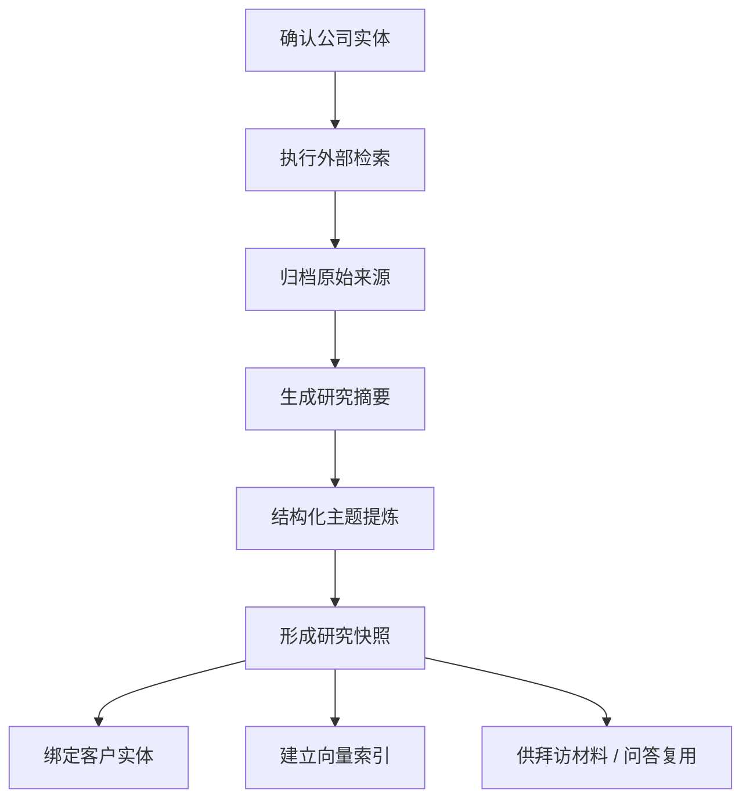

# 公司分析场景设计

> 当前版本说明：
> 本文保留为未来“公司深度分析”场景的预研稿。当前 v1 中，“公司分析”已收敛为外部技能，核心输入是 `companyName`，不按本文件中的完整场景方式纳入主线。

## 本篇回答什么问题

本篇回答以下问题：

- 公司分析为什么是 v1 核心能力
- 公司分析从检索到研究快照的完整链路是什么
- 原始资料、研究快照、向量块如何存储
- 公司分析结果如何被后续场景复用

## 场景定义

公司分析场景的正式名称为：

- `公司分析与企业研究`

它的目标不是一次性生成一份报告，而是把目标企业的公开研究结果沉淀为：

- 企业研究快照
- 客户背景资产
- 可被后续场景复用的知识输入

## 触发入口

### 入口 1：用户主动触发

例如：

- “分析一下华为”
- “帮我研究这家公司”

### 入口 2：新建客户后触发

在用户创建新客户后，系统可建议启动轻量研究。

### 入口 3：准备拜访材料时触发

当拜访场景发现公司分析缺失或过期，可后台补齐。

## 最小输入

- `eid`
- `appId`
- `userId`
- `threadId`
- `companyName`

### 推荐补充输入

- `customerId`
- `industryHint`
- `researchGoal`
- `researchDepth`

## 处理流水线

## 输出分层设计

### 1. 原始资料层

原始资料层保存：

- 搜索结果
- 抓取文本
- 来源链接
- 抓取时间
- 来源可信度

这层用于：

- 溯源
- 重新摘要
- 版本追踪

### 2. 研究摘要层

研究摘要层保存结构化研究结果，例如：

- 公司概况
- 行业定位
- 核心产品
- 组织线索
- 近期动态
- 风险提示
- 合作切入点

### 3. 业务消费层

业务消费层是为了下游场景直接使用的结构化产物，例如：

- 客户背景摘要
- 拜访前应知信息
- 推荐问题清单
- 潜在异议
- 竞争与风险提示

## 研究快照设计

每次公司分析都不直接覆盖旧结果，而生成一个新的 `研究快照`。

### 研究快照字段建议

- `snapshot_id`
- `eid`
- `appId`
- `customer_id`
- `company_name`
- `generated_at`
- `source_window`
- `freshness_level`
- `summary_markdown`
- `structured_sections`
- `source_count`
- `confidence_score`
- `status`

### 这样设计的原因

- 支持历史回溯
- 支持失效重建
- 支持后续场景引用具体版本

## 存储设计

### 对象存储

保存：

- 原始网页快照
- 原始抓取文本
- 研究 Markdown / 导出文件

路径建议：

`eid/appId/research/{snapshot_id}/...`

### 主数据库

保存：

- 研究快照元数据
- 结构化摘要
- 来源清单
- 与客户实体的绑定关系
- 刷新状态
- 审计事件

建议核心实体：

- `company_profile_snapshot`
- `research_source_item`
- `artifact_file`
- `audit_event`

### 向量索引

保存：

- 抓取文本块
- 研究摘要块
- 业务消费摘要块

## 数据消费设计

公司分析结果必须能被以下场景消费：

### 1. 准备拜访材料

消费内容包括：

- 公司概况
- 行业定位
- 近期动态
- 风险与关注点

### 2. 对话问答

例如：

- “这家公司是做什么的”
- “最近有什么值得关注的动态”
- “拜访时应该重点聊什么”

### 3. 客户分析

消费内容包括：

- 业务特征
- 行业特征
- 合作切入点
- 风险提示

### 4. 后续通用助手复用

如未来做合同助手、市场助手，也可以引用该研究快照作为外部背景输入。

## 时效性与刷新策略

### 时效性字段

研究快照必须至少保存：

- 生成时间
- 来源时间窗口
- 快照有效期
- 新鲜度等级

### 刷新策略

- 新建客户：可先生成轻量快照
- 用户主动请求：允许立即刷新
- 准备拜访材料时：若超过阈值则做增量刷新

### 刷新原则

优先增量刷新，不做无条件全量重做。

## 租户隔离与绑定

所有公司分析结果都必须带：

- `eid`
- `appId`

### 绑定策略

优先绑定：

- `customer_id`

如果客户尚未正式建立，则允许创建“待认领公司实体”，等用户确认后再绑定正式客户。

## 降级策略

### 外部搜索失败

允许使用：

- 历史研究快照
- 影子系统已有字段
- 用户手工补充信息

### 资料不足

允许输出轻量结果：

- 公司概览
- 已知事实
- 资料缺口说明

而不是完全无结果。

## 在不同主存储方案下的落点

### 方案 A：PostgreSQL + pgvector

- 研究快照、来源清单、客户绑定关系、任务状态放 PostgreSQL
- 原始网页与抓取原文放对象存储
- 研究块放 pgvector

优点：

- 研究快照与客户实体关系清晰
- 更适合被准备拜访材料、问答反复引用

### 方案 B：MongoDB + 向量数据库

- 原始抓取结果、研究中间文档、摘要可整体放 MongoDB
- 向量检索走 Atlas Vector Search 或独立向量库

优点：

- 原始文档结构灵活

代价：

- 研究快照与客户、任务、审计、版本引用之间仍需额外治理

## 本篇结论

公司分析的关键不是“生成报告”，而是“形成研究快照资产”。

这个资产必须：

1. 能绑定客户
2. 能区分版本
3. 能被拜访准备、问答、客户分析重复消费
4. 能在租户边界内被可靠存储、刷新和审计
