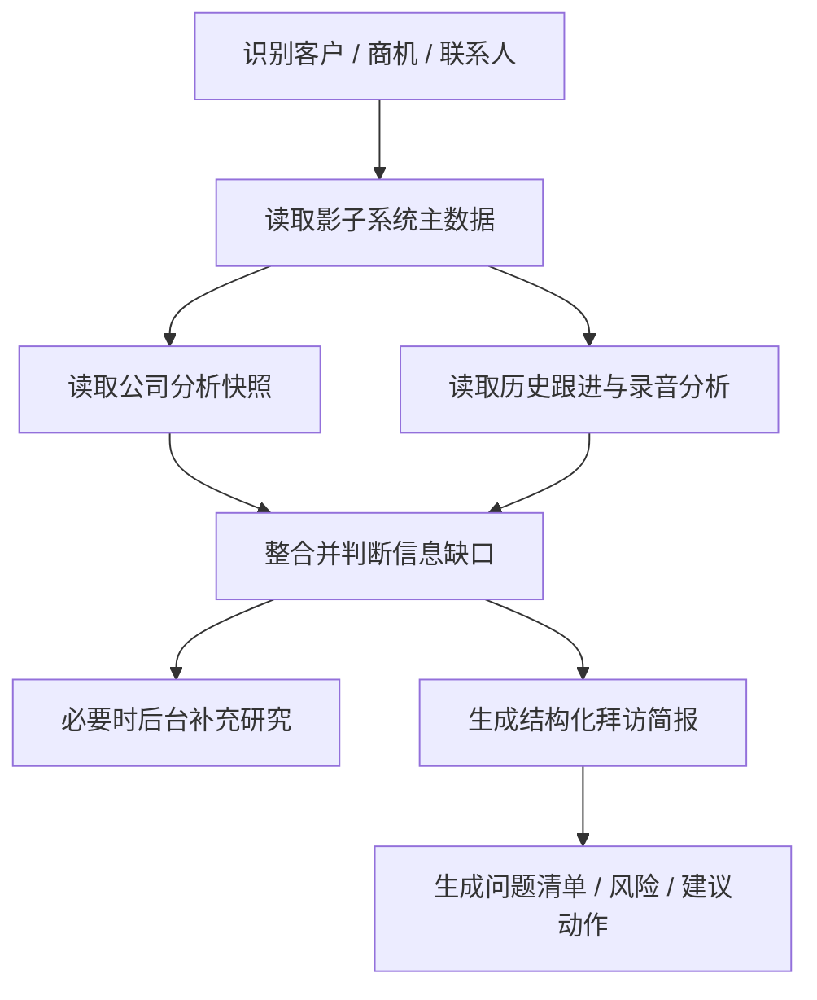

# 准备拜访材料场景设计

## 本篇回答什么问题

本篇回答以下问题：

- 准备拜访材料为什么是场景技能而不是单一技能
- 它依赖哪些输入
- 核心输出是什么
- 为什么这个场景最能体现多源数据消费能力

## 场景定义

准备拜访材料是 `AI销售助手` 的复合场景技能。

它的目标是：

在拜访前自动整合客户、联系人、商机、历史跟进、录音分析、公司研究等多源信息，为销售生成一份可立即使用的拜访简报。

## v1 标准输出

v1 的标准输出不是 PPT，而是：

- 拜访摘要卡片
- Markdown 一页简报
- 建议沟通问题
- 风险与异议预测
- 建议动作清单

## 最小输入

- `eid`
- `appId`
- `userId`
- `threadId`
- `customerId` 或 `customerCode`

### 推荐补充输入

- `opportunityId`
- `contactIds`
- `visitDate`
- `visitType`
- `visitGoal`

## 依赖的数据源

准备拜访材料必须消费以下数据：

### 1. 影子系统主数据

- 客户基础信息
- 联系人列表
- 商机信息
- 历史商机跟进记录

### 2. 公司分析快照

- 企业概况
- 行业定位
- 最近动态
- 可能切入点

### 3. 录音导入分析结果

- 最近拜访摘要
- 关键风险
- 异议与承诺
- 历史问题线索

### 4. AI-CRM 原生实体记忆

- 联系人画像
- 联系人关系
- 历史任务摘要
- 关键事件时间线

## 场景编排

## 生成内容建议

### 1. 拜访目标摘要

- 本次拜访为什么重要
- 当前最关键的业务背景

### 2. 客户与公司背景

- 公司做什么
- 当前行业位置
- 最近值得关注的动态

### 3. 关键联系人与关系提示

- 本次应重点关注谁
- 对应角色与关注点是什么

### 4. 当前商机状态

- 当前阶段
- 预算 / 需求 / 时间 / 决策 / 关系 / 竞争 的已知情况

### 5. 历史跟进与录音关键信号

- 上次拜访的重点
- 已承诺事项
- 潜在异议
- 风险变化

### 6. 拜访建议

- 建议优先问的问题
- 建议避免的话题
- 建议推进动作

## 缺口处理策略

当数据不完整时，不应直接失败，而应进行缺口分类：

### A 类：可容忍缺口

例如：

- 缺少最近研究快照
- 缺少最近录音分析

可先给出简版简报，并提示可后台补齐。

### B 类：需用户澄清

例如：

- 客户不明确
- 存在多个同名客户
- 商机目标不明确

此时应触发澄清卡片。

### C 类：关键事实缺失

例如：

- 客户实体不存在
- 当前用户无权访问相关客户

应中断并提示。

## 与录音导入、公司分析的关系

### 录音导入对本场景的价值

录音导入提供：

- 客户真实关注点
- 异议与承诺
- 最近推进风险

这是单纯依靠结构化字段无法得到的。

### 公司分析对本场景的价值

公司分析提供：

- 企业背景
- 行业定位
- 最近动态
- 外部切入点

这是单纯依靠影子系统对象也无法得到的。

## 多源消费复杂度对比

准备拜访材料是最能拉开存储方案差异的场景。

### 为什么复杂

因为它同时依赖：

- 多个结构化对象关联
- 研究快照版本
- 录音分析版本
- 联系人关系
- 最近任务与事件

### 对存储选型的影响

在 `PostgreSQL + pgvector` 下：

- 多表过滤、版本引用、状态组合更自然

在 `MongoDB + 向量数据库` 下：

- 原始文档和研究中间结果很灵活
- 但多实体关联和版本治理复杂度更高

因此，这个场景应作为存储选型比较中的重点验证场景。

## 在不同主存储方案下的落点

### 方案 A：PostgreSQL + pgvector

适合：

- 以实体关联和多源组合查询为主
- 需要强任务状态和审计
- 需要以客户 / 商机为锚点拼装结果

### 方案 B：MongoDB + 向量数据库

适合：

- 研究与录音文档体量极大
- 查询更偏向整文档聚合
- 团队已有成熟 Mongo 体系

## 本篇结论

准备拜访材料是 v1 最能体现 AI销售助手 价值的复合场景能力。

它的本质不是“生成文档”，而是：

1. 消费多源资产
2. 识别信息缺口
3. 形成有行动价值的结构化简报

也正因为它是多源消费场景，它必须和录音导入、公司分析、数据架构、对话编排设计保持完全一致。
