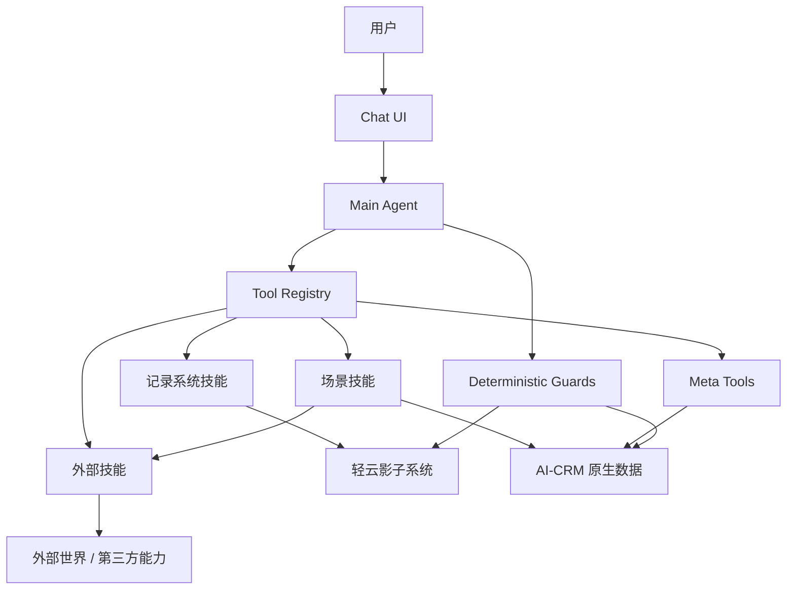

# 用户对话层与Agent编排

## 本篇回答什么问题

本篇回答以下问题：

- `AI销售助手` 的对话层应该如何组织
- Main Agent、Tool Registry、Meta Tools、确定性守卫分别负责什么
- 核心场景能力与公司分析外部技能如何在对话层被调起
- 外部技能如公司分析、联网搜索、转写、PPT 生成如何纳入编排
- 如何避免上层 Agent 被底层数据库选型绑死

## 对话层目标

用户希望在对话中完成的是：

- 录入客户、联系人、商机、跟进记录
- 查询客户、商机与历史跟进
- 导入录音并创建商机跟进记录
- 分析目标公司
- 准备拜访材料

因此，对话层不应只是问答接口，而是系统的主入口。

## 总体架构

## 四个核心角色

### 1. Main Agent

负责：

- 理解用户输入
- 判断当前意图
- 选择合适的技能或 Meta Tool
- 决定是否需要澄清、后台执行或确认

不负责：

- 直接写主数据
- 直接跳过权限与确认

### 2. Tool Registry

负责暴露全部可用工具：

- 记录系统动态技能
- 场景技能
- 外部技能
- Meta Tools

### 3. Meta Tools

固定保留三个：

- `clarify_card`
- `query_with_context`
- `plan_composite`

### 4. Deterministic Guards

负责保底约束：

- 写操作确认
- 权限校验
- 音频导入流程控制
- 后台任务通知
- 跨租户引用拦截

## Tool 分类

### A. 记录系统技能

例如：

- `shadow.customer_create`
- `shadow.contact_create`
- `shadow.opportunity_update`
- `shadow.followup_record_create`

### B. 场景技能

例如：

- `scene.audio_import`
- `scene.visit_prepare`

其中：

- `scene.audio_import` 是单一场景技能
- 首次拜访、已有客户首次拜访、多次拜访不是三个技能
- 它们只是 `scene.audio_import` 在不同上下文成熟度下的内部处理分支

当前不纳入：

- `scene.company_deep_analysis`

### C. 外部技能

例如：

- `ext.company_research_pm`
- `ext.web_search`
- `ext.web_fetch_extract`
- `ext.audio_transcribe`
- `ext.presentation_generate`

### 外部技能 provider 策略

当前阶段，Tool Registry 不只要知道“有哪些技能”，还要知道“这些技能当前走哪个 provider”。

阶段性收敛如下：

- `scene.audio_import` 相关链路优先走已有的通义 Agent 服务
- 其他外部技能先统一走 `mock provider`

建议至少维护以下映射关系：

- `ext.audio_transcribe -> tongyi_agent_provider`
- `ext.company_research_pm -> mock_provider`
- `ext.web_search -> mock_provider`
- `ext.web_fetch_extract -> mock_provider`
- `ext.presentation_generate -> mock_provider`

### 为什么要这样做

原因不是因为 mock 更好，而是：

- 录音导入是 v1 核心场景
- 通义 Agent 服务已经存在，可直接复用
- 其他外部技能先 mock，更有利于尽快打通全链路

### 编排层要求

对 Main Agent 和场景技能来说：

- 只感知 `skill_code`
- 不感知底层到底是通义、mock 还是未来真实 provider

这样后续替换 provider 时，不需要重写上层编排逻辑。

## `scene.audio_import` 的统一契约

文档层面，`scene.audio_import` 的定义需要从“录音分析驱动的跟进候选生成”收敛为：

- 商机跟进记录创建场景
- 录音异步分析场景

### 输入重点

该场景至少接受：

- `audioFile`

并按上下文情况补充：

- `customerId`
- `opportunityId`
- `contactIds`
- `visitDate`

### 输出重点

该场景至少统一输出：

- `task_status`
- `next_required_action`
- `customer_candidate`
- `opportunity_candidate`
- `followup_record_id`
- `analysis_status`
- `contact_edit_status`

### 通义分析补充输出

通义分析结果建议至少补充：

- `contact_candidates[]`

其中每个联系人候选至少包含：

- `name`
- `title`
- `phone`
- `source_segment_refs`

### `next_required_action` 固定取值

至少包含：

- `create_customer`
- `create_opportunity`
- `select_opportunity`
- `create_followup_record`
- `wait_analysis`

### Main Agent 的判断边界

Main Agent 不需要判断“这是第几次拜访”。

它只需要命中：

- `scene.audio_import`

再由该场景技能根据当前上下文状态决定后续分支。

### D. Meta Tools

例如：

- `clarify_card`
- `query_with_context`
- `plan_composite`

## 外部技能的调用边界

外部技能应作为 Tool Registry 的正式组成部分，但不应和场景技能混成一类。

### 适合直接调用外部技能的情况

- 用户要做一个低风险的通用动作
- 不需要绑定客户、商机、任务状态
- 不需要沉淀研究快照或业务资产

例如：

- “分析一下华为”
- “搜一下这家公司最近新闻”
- “把这份简报导出成 PPT”

### 不适合直接调用外部技能的情况

- 目标是完成完整业务场景
- 需要绑定客户或商机
- 需要后台任务、快照、版本、审计

例如：

- “导入这段录音并生成跟进记录”
- “帮我准备明天拜访材料”
- “围绕某个客户生成可长期复用的公司研究资产”

这类请求应优先命中：

- `scene.audio_import`
- `scene.visit_prepare`

最后一类未来如需实现，应单独设计为：

- `scene.company_deep_analysis`

## 检索层抽象接口

为了避免上层 Agent 被底层数据库绑死，对话层必须只依赖统一检索接口，不直接依赖 Postgres 或 Mongo 的具体查询语法。

### 抽象接口

建议在文档中统一定义以下抽象：

#### `EntityContextRepository`

负责按实体读取聚合上下文：

- 客户上下文
- 联系人上下文
- 商机上下文

#### `KnowledgeSearchRepository`

负责语义检索：

- 研究快照块检索
- 录音摘要块检索
- 相似历史问题检索

#### `TaskStateRepository`

负责：

- 任务状态
- 后台任务
- 恢复点

#### `ArtifactRepository`

负责：

- 文件引用
- 研究快照
- 转写原文引用

### 抽象接口的价值

这样设计后：

- 上层 Agent 只关心“拿到什么上下文”
- 不关心底层到底是 PostgreSQL + pgvector，还是 MongoDB + 向量数据库

## 典型能力在对话层中的处理

### 场景 1：录入客户但字段不全

处理方式：

1. Main Agent 识别为结构化写操作
2. 选择记录系统技能
3. 如果缺字段，调用 `clarify_card`
4. 收齐参数后生成写入预览
5. 通过确定性守卫确认后写轻云

### 场景 2：录音导入

处理方式：

1. 用户上传音频
2. 确定性守卫创建后台任务
3. `scene.audio_import` 先补齐客户 / 商机上下文
4. 创建商机跟进记录
5. 跟进记录创建成功后调用已有通义 Agent 服务执行录音分析
6. 分析结果沉淀到 AI-CRM 原生层
7. 如通义识别出联系人候选，可触发联系人补充侧流程

### 录音导入的三条内部处理分支

#### A. 首次拜访，无客户无商机

1. 进入 `create_customer`
2. 再进入 `create_opportunity`
3. 再进入 `create_followup_record`
4. 跟进记录创建成功后进入 `wait_analysis`

#### B. 已有客户，首次拜访

1. 复用客户上下文
2. 默认进入 `create_opportunity`
3. 商机创建后进入 `create_followup_record`
4. 跟进记录创建成功后进入 `wait_analysis`

#### C. 已有客户，多次拜访

1. 若存在唯一明确商机，则直接预填
2. 若存在多个商机，则进入 `select_opportunity`
3. 若没有可用商机，则进入 `create_opportunity`
4. 商机明确后进入 `create_followup_record`
5. 跟进记录创建成功后进入 `wait_analysis`

### 录音分析后的联系人补充子流程

该流程属于：

- `scene.audio_import` 的后置扩展

但需要明确：

- 它不是新的场景技能
- 它不影响主录音任务完成判定

### 流程说明

1. 通义分析完成后输出 `contact_candidates`
2. 打开通义独立联系人编辑界面
3. 界面按当前客户拉取影子系统联系人
4. 用户对每个候选执行：
   - 选择已有联系人
   - 新建联系人
   - 忽略
5. 联系人处理结果单独更新 `contact_edit_status`

### Main Agent 的边界

Main Agent 不负责：

- 联系人逐个去重判断
- 我司成员识别
- 联系人逐条编辑确认

这些步骤统一交由：

- 通义独立联系人编辑界面

### 影子系统写技能边界

联系人补充阶段只允许调用：

- `shadow.contact_query`
- `shadow.contact_create`

明确不做：

- `shadow.contact_update`
- `shadow.followup_record_update`

### `contact_edit_status` 建议固定取值

- `pending_manual_edit`
- `completed`
- `skipped`

### 能力 3：公司分析

这里的“公司分析”指外部技能，而不是场景技能。

处理方式：

1. Main Agent 识别为外部研究请求
2. 提取 `companyName`
3. 当前先调用 `ext.company_research_pm` 的 `mock provider`
4. 返回研究摘要与来源说明
5. 如未来需要形成长期资产，再进入单独的“公司深度分析”场景设计

### 场景 4：准备拜访材料

处理方式：

1. Main Agent 调用 `plan_composite`
2. 命中“准备拜访材料”模板
3. 模板内部读取影子系统主数据、录音分析资产
4. 必要时调用 `ext.company_research_pm` 的 `mock provider` 补充公开公司信息
5. 返回拜访简报

## 模板化复合任务

v1 的 `plan_composite` 只允许命中预定义模板，不开放自由 DAG。

### v1 模板清单

- 录音导入并创建商机跟进记录
- 准备拜访材料

### 为什么不开放自由 DAG

- 销售场景需要可解释与可审计
- v1 重点是把高频场景走通，而不是追求开放式 Agent 炫技

## 状态管理

对话层至少要维护以下状态：

- 当前线程上下文
- 当前焦点客户 / 商机
- 当前挂起任务
- 后台任务进度
- `scene.audio_import` 的 `next_required_action`
- 最近消费的研究快照与录音分析版本

## 提示与确认策略

### 应触发澄清的情况

- 客户不明确
- 商机不明确
- 存在多个候选商机
- 写操作缺少必填字段

### 应触发确认的情况

- 写轻云主数据
- 覆盖已有关键字段
- 用 AI 推断结果回写主数据

## 本篇结论

`AI销售助手` 的对话层必须坚持以下原则：

1. Main Agent 负责理解和选择
2. Tool Registry 负责暴露记录系统技能、场景技能、外部技能与 Meta Tools
3. 当前“公司分析”属于外部技能，输入核心是 `companyName`
4. 外部技能负责联网、研究、转写、导出等通用能力，但不替代业务场景
5. Meta Tools 负责结构化交互
6. 确定性守卫负责企业级兜底
7. 检索层必须抽象，不能把数据库选型泄漏到上层对话逻辑中
